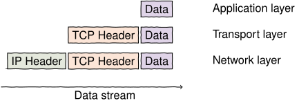
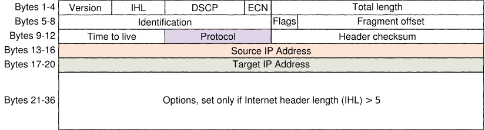
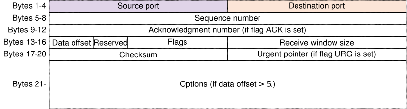

Next, we are going to discuss major protocols stipulating the communication between the devices
connected to the Internet.

## Internet is like an onion

Internet has layers. Different protocols that are responsible for communication can be grouped
in 4 layers.

1. Link layer 
2. Internet/network layer
3. Transport layer
4. Application layer

Protocols at the link layer are responsible for direct communication between
two entities over the same link, for example, a protocol responsible
communication between a laptop and a WiFi-router establishes the 
frequency, as well as how bits are transferred over that frequency. On the
other extreme, the protocols in the application layer establish common language between
two applications sharing information, for example, the HTTP protocol describes how
a web browser should request information from a web server.

Note that the upper layers do not care how the lower layers are implemented as
long as certain services are provided by the lower layers: HTTP does not care
whether the connection is over wireless, RJ-45 cable, or a smartphone, or a
combination of many. Similarly, the lower layers do not care (at least in
theory) about the payload of the application layer.

Our primary interest for now is the internet layer and the transport layer.

<figure>

_An example of data packet being wrapped in TCP and IP headers. Link layer is not shown._

</figure>

<text-box variant="emph" name="How many layers are needed">

Grouping protocols in 4 layers is often referred as _TCP/IP model_ (named after the two most important protocols) or
_internet protocol suite_. Often the link layer is split in 2 layers, physical link, and data link, leading to 5 layers instead of 4.

We can also use Open Systems Interconnection model (OSI model) which has 7 layers.
 
</text-box>

## Internet layer and IP protocol

The key protocol at the network layer is Internet Protocol (IP).
An IP packet consists of the payload and a header. A real-life analogy would
be a letter: the header is the envelope while the payload is the contents of the letter.

The protocol establishes several fundamental things.

First, and most important, each device in the network is given an IP address. In IPv4 the address consists
of 4 bytes (numbers ranging between 0--255). Partly due to bad management, IP addresses using only 4 bytes
are (almost) run out, so a new protocol IPv6 was introduced that uses 32 bytes as address. Both protocols
are used but IPv4 is still the dominant protocol as of 2020.

<figure>

_Structure of the IPv4 header. Several key fields are highlighed._

</figure>

IP protocol allows data packet fragmentation if the underlying layer has a limited
packet size, and is smaller than the payload.  That is, if the payload is larger than
what the link layer can transmit in one packet, IP protocol will chop the packet in smaller
fragments, and transmit them individually.
A maximum size for a single IP
packet is 65535 bytes of which 20 bytes are an IP header. Naive implementations of IP fragmentation 
allowed for [exploits](https://www.kyberturvallisuuskeskus.fi/en/vulnerability-handling-ip-fragments) such as denial-of-service attacks.

IP also provides a checksum to make sure that the payload has not been
corrupted. Note that the goal of this checksum is to protect from non-malicious
errors due to, for example noisy underlying communication channel. If the packet
is modified by an attacker, it is trivial to compute a new valid checksum for
that particular packet. 

When a device, either the end host or a router, notices a corrupted IP packet,
it is dropped, and an error message is sent back.

Note that IP protocol does not directly tell how to deliver a packet. The decision
is done by an IP routing algorithm at the router. The main idea behind such algorithm is that a router studies the IP
address and compares it to a _routing table_. The routing table can be viewed as a set of devices (routers or hosts) connected
to the router, each device associated with an IP address range.
If the target IP falls into a range, then the packet is submitted to the next router (or a host)
associated with that range. The routing tables can be either static, that is, written by hand, or can be
dynamic, using various protocols to keep themselves up to date.

Internet routing is designed in such a way that if the most common (and optimal)
communication channel is disrupted, a router will try to establish a new, less-than-ideal route.
However, if all communication lines are [disrupted](https://www.theguardian.com/world/2011/apr/06/georgian-woman-cuts-web-access)
there is nothing that can be done to restore the connection.

IP header has a field named protocol, indicating the type of a payload being
delivered.  For example, a protocol may indicate that the payload is a
TCP packet (we will discuss this protocol later),
or packets related to route discovery algorithms.

A notable example among these protocols is Internet Control Message Protocol (ICMP). This protocol is used
for sending errors and communication network information.
The most (in)famous use of ICMP is Ping, a network utility to see whether a
specific host is reachable and how long does it take to reach it.
A classic denial-of-service (DoS) attack, Ping Flood, involves in flooding the victim with many ping requests
hoping to overwhelm the victim's computer. Another attack is [Ping of Death](https://en.wikipedia.org/wiki/Ping_of_death)
which is actually an IP fragmentation attack with ICMP being used as the payload.

The IP protocol does not care about the specifics of the lower layers except
when determining whether fragmentation is needed. In fact, IP could be used over
[pigeons](https://tools.ietf.org/html/rfc1149).

## Transport layer: TCP and UDP

IP lacks several key features making it directly unusable.

Firstly, IP does not distinguish between different applications at the same
host.  For example, if a user has an open SSH shell connection and downloads a
web page through a browser, IP does not have means to direct the incoming data to a web
browser instead of a shell.

Secondly, IP is stateless, meaning that each packet is processed individually.
This means that while IP provides some protection against corrupted packets,
it does not guarantee that the packets arrive in order. Moreover, packets can
be duplicated. Finally, if a packet is lost for some reason, IP does not provide reliable mechanism
to resend the packet.

Transmission Control Protocol (TCP) solves these issues.

TCP connection is between two agents: a _server_ is waiting for a connection
while the _client_ initates the connection. Here the server could be a web server
while the client is the web browser.

TCP has a state: upon connection a client and a server undergo a handshake
protocol where several packets are sent back and forth making sure that both
parties are on the same page.  Integrity of the data stream is maintained by
counters on both sides, and sending an acknowledgment packet every time a data packet arrives.  If the sender does not
receive acknowledgment reply for a data packet within a certain amount of time, he
will resubmit the packet.

TCP also introduces a concept of a port: each connection has two ports, one for
both sides. A port is an integer between 0 and 65535. A server typically waits
for a new connection at a well-known port. Default ports for widely-used
protocols are well-established and are typically small numbers, for example,
HTTP uses port 80. A client also needs its own port. These ports are typically
large numbers selected automatically by an operating system, based on what ports are
available.

<figure>

_Structure of the TCP header. Port fields are highlighed._

</figure>

TCP provides a reliable data stream connection between two devices. The drawback
of the protocol is significant overhead, especially due to the acknowledgment
packets.  This latency is not acceptable in certain real-time applications,
for example, online gaming. An alternative protocol for TCP is User Datagram
Protocol (UDP), a simple protocol providing ports and a(n optional) checksum as
additional services, and nothing else. 

<figure>

_Structure of the UDP header. Port fields are highlighed._

</figure>

<text-box variant="emph" name="LAN and NAT">

Most of the internet users, home or at work, are not directly connected to the internet.
Instead they are connected to a local area network (LAN). The local network is connected
to the internet via a router. In home setting the router is often the WiFi station.
Such station often provides other services such as

* Firewall, blocking selectively incoming (and outgoing) connections.
* DHCP server, dynamically assigning new IP addresses to new devices appearing in the LAN
* NAT service, which maps local IP address, TCP/UDP port combinations to global IP address, ports.
This is specifically handy, if the internet service provider (ISP) provides only one IP address
but a user wishes to have multiple devices connected. NAT allows users to have
local unique IP addresses that are mapped to the same global IP address. The mapping is done using either TCP or UDP ports.

</text-box>

## Internet and security

Neither TCP nor IP protocol has any built-in security. This means, unless other
measures are taken, traffic data can be intercepted or, worse, modified. This
is known as a man-in-the-middle attack, and modifying traffic can extremely
sophisticated, for example,
[injecting](https://thenextweb.com/insights/2017/12/11/comcast-continues-to-inject-its-own-code-into-websites-you-visit/)
(java script) code to a web browser when a user visits 3rd party websites.

Data encryption can be done in a link layer, for example, WiFi can use WPA2 to
encrypt its traffic.  Similarly, data over cellular connection is encrypted.
However, Ethernet (common protocol for cable-based local area networks) does
not have any protection. Moreover, link layer encryption does not guarantee
that the data will stay encrypted all the way to the host, if the underlying medium
is changed during the transmission.

For this reason, encryption is typically done in an application layer, with secure
protocols replacing plain-text protocols. Examples include:

* SSH over telnet for remote shell connection
* HTTPS over HTTP for communicating with a web server
* SFTP over FTP for transmitting files

The protocols establish a secure channel between two devices so that sensitive
data cannot be observed. However, what can be observed is the address and the
port, that is, a man-in-the-middle knows that the user has contacted the
server, and he probably can guess the requested service based on the port, but
the actual payload cannot be observed.

It is possible to use the encryption protocol (known as TLS) used by HTTPS to
encode normal IP traffic. Here, the user connects to a special server and establishes
a secure channel. Using this channel the user sends IP data packets. 
The server then decrypts the stream, and forwards the
packets to the address specified in the packets. The server also modifies the
TCP/IP headers (similar to NAT) so that it seems that the connection is coming
from the server. This also allows for a user to receive replies, as the server
will forward back any incoming reply back to the user over the secure channel.

This is essentially a version of Virtual Private Network (VPN). Note that we
are wrapping an IP packet in a TLS stream, which in turns uses TCP, which again
uses IP.  Especially, having TCP protocol may lead to performance issues, and
because of this IP Security (IPSec) is more common for VPN. IPSec data
transmission protocols are implemented directly over IP (similar to TCP or
ICMP) and are considered to be in network layer. Because TCP protocol is not
used between the native IP packets and the encrypted payload, the latency issues
are significantly smaller.

Note that the payload is decrypted at the end point of VPN before it is
forwarded to its real target. Since the IP address is also modified, an
external party cannot deduce the user identity based on the IP information.
However, any sensitive information that is not encrypted separately in the
payload (such as passwords sent over plain HTTP) can be read after VPN.

<quiz id="1ab90666-ba0a-5c1d-b8ed-b0491d8c14d7"></quiz>
