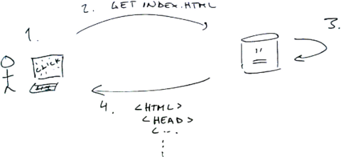

Web servers are essentially programs that listen to incoming connections (typically, on port 80) and follow the [HTTP](https://en.wikipedia.org/wiki/Hypertext_Transfer_Protocol)-protocol. Whilst at first, web servers were mainly used to serve static content such as HTML pages and funny GIF images, they nowadays serve dynamic content that is often built separately for each user.

Web applications run on the web servers. Web servers listen for the incoming connections and forward the connections to the web applications. Developers who work with web applications very rarely implement functionality within the web servers.

Web applications include both client- and server-side functionality. Client-side functionality is executed in the browser of an user, i.e. you, whilst the server-side functionality is executed on the web server.

Whenever the user makes an action such as types in an URL and presses enter or clicks a link in the browser, the user's computer sends a request to the server. Once the server receives the request, it processes it and builds a corresponding response. The response may be, for example, HTML-code, JSON data, or an image that the browser should display to the user.



_Flow of a typical request: (1) the user clicks a link on the browser, (2) the
browser makes a request to the server, (3) the server receives the request and
constructs a response, (4) the server returns the response, (5) the response is
processed within the browser (and, e.g., shown to the user) -- not in the
picture._

When constructing the functionality that is shown in the browser, development
is typically focused on three separate and intertwined fronts. The structure of
the view is constructed using [HTML](http://en.wikipedia.org/wiki/HTML), the
layout and theme using [CSS](http://en.wikipedia.org/wiki/CSS), and possible
dynamic functionality with
[JavaScript](http://en.wikipedia.org/wiki/JavaScript).

On the other hand, when constructing the functionality that is executed on the
backend -- i.e. the server --, the developer typically focuses on the
functionality that is needed to retrieve and construct the response that needs
to be sent back to the user. This often involves connecting to other software
such as a database server, and retrieving data from there. The server may --
again -- run either locally or on a separate machine. Naturally, the client-
and server-side development can be interlinked, and software developers
typically work on tasks that are related to both sides. That is, these days it
is rather rare that a developer focuses solely on e.g. maintaining a database.

When the user accesses an online page using a browser, a request is sent to the
server. The server creates the content of the response and sends it back to the
user. If the content has links to other resources such as images or scripts,
each of these resources are retrieved separately by the browser (except for the
[HTTP/2 Server Push](https://en.wikipedia.org/wiki/HTTP/2_Server_Push)-model).

<text-box variant=emph name="It is not just about the requests, but..">

Each resource that the browser retrieves is also a potential security threat.
For example, if a malicious user has found means to include his or her own
Javascript as a part of a site, the Javascript will be executed on the users'
machine.

Whilst this may not at first sound like such a bad deal, it can -- for example
-- lead to each and every keypress you make being sent to the malicious user
(hello passwords!). Or, you could be redirected to a replica of the page that
you were supposed to be using, and -- again, for example -- end up ordering
non-existing products and giving out your credit card details.

</text-box>


## Building a Simple Web Application

The main functionality of a web application is to create a response to each
request. Developers do not typically implement the web-server functionality and
the HTTP-protocol specifics, but use a framework that abstracts away many of
the existing tasks. Here, we look at one such framework, called
[Spring](https://spring.io/).

<text-box variant=emph name="Java and Maven">

In the following examples, we use [Maven](http://maven.apache.org/) to handle the dependencies. It is similar in functionality to other tools such as [pip](https://en.wikipedia.org/wiki/Pip_(package_manager)) and [npm](https://www.npmjs.com/)

Most Java Development environments come with Maven; if you installed NetBeans previously, Maven is included.

</text-box>

Using [Spring Boot](https://projects.spring.io/spring-boot/), a web application that returns "Hello World!" to any request looks as follows.


```java
import org.springframework.stereotype.Controller;
import org.springframework.web.bind.annotation.RequestMapping;
import org.springframework.web.bind.annotation.ResponseBody;

@Controller
public class HelloWorldController {

    @RequestMapping("*")
    @ResponseBody
    public String home() {
        return "Hello World!";
    }
}
```

There are a few items of interest. The `@Controller` annotation indicates that
this class contains code that handles requests. The `@RequestMapping`
annotation defines the request paths (e.g. "/hello") that the subsequent method
will handle, and the `@ResponseBody` annotation essentially says that the
response that has been created in the method should be sent directly to the
user requesting the content.

In the above example, any request that is made to the web application will
return the text "Hello World!".

<programming-exercise name="Hello Web!" tmcname="Set1-02.HelloWeb">


In this assignment, you will familiarize yourself with the very basic
functionality of the web framework, and will create an application that returns
a "Hello Web!" response to the user.

The assignment template contains a few files. The file `HelloWebApplication` is
used to launch the web application, and the file `HelloWebController` is used
to create the response to the user. Modify the class `HelloWebController` so
that the user will receive the text "Hello Web!" when he or she sends a request
to the server.

Note that you may have to download the _dependencies_ that the framework uses.
In NetBeans, this can be done by selecting the Dependencies, and selecting
"Download Declared Dependencies".

Once finished, submit the assignment to the TMC server.

</programming-exercise>


## Requests and Responses

Each request receives one response.

The annotation `@RequestMapping` defines the path or paths that the method
following the annotation will handle. If the path is defined using an asterisk,
i.e. `@RequestMapping("*")`, then all requests are forwarded to that specific
method.

The path can be defined also more explicitly. For example,
`@RequestMapping("/secret")` would forward all the requests that come to the
path "/secret" to the method. In the example below, all such requests receive
the response `"Kryptos"`.


```java
@RequestMapping("/secret")
@ResponseBody
public String home() {
    return "Kryptos";
}
```

Web applications typically respond to requests to multiple paths, where each
path has specific functionality. In the example below, there are three separate
paths, each of them returning a String as a response to the user.

```java
import org.springframework.stereotype.Controller;
import org.springframework.web.bind.annotation.RequestMapping;
import org.springframework.web.bind.annotation.ResponseBody;

@Controller
public class PathController {

    @RequestMapping("/path")
    @ResponseBody
    public String path() {
        return "Path";
    }

    @RequestMapping("/route")
    @ResponseBody
    public String route() {
        return "Route";
    }

    @RequestMapping("/trail")
    @ResponseBody
    public String trail() {
        return "Trail";
    }
}
```


Each request may contain information that is being sent to the web application.
In principle, there are two ways to handle this: (1) by adding parameters to
the address, or by (2) adding parameters to the request body. We will look into
the request body later in the course.

The parameters can be accessed using the
[@RequestParam](http://docs.spring.io/spring/docs/current/javadoc-api/org/springframework/web/bind/annotation/RequestParam.html)-annotation.
In the example below, the application greets every user that makes a request to
the application; the application expects that the user sends information as a
part of the request, and that the parameter name is "user".

```java
import org.springframework.stereotype.Controller;
import org.springframework.web.bind.annotation.RequestMapping;
import org.springframework.web.bind.annotation.RequestParam;
import org.springframework.web.bind.annotation.ResponseBody;

@Controller
public class GreetingController {

    @RequestMapping("/greet")
    @ResponseBody
    public String greet(@RequestParam String user) {
        return "Hi " + user + ", how are you?";
    }
}
```

If the server hosting the application would be running on port `8080`, a request to `http://localhost:8080/greet?user=Ada` would receive a response "Hi Ada, how are you?".


<programming-exercise name="Calculator" tmcname="Set1-03.Calculator">


In this assignment, you will familiarize yourself with handling (1) requests to
several paths and (2) request parameters. Implement the following functionality
to the class `CalculatorController` that can be found in the package
`sec.calculator`.

* A request to the path `/add` sums the values in the request parameters
  `first` and `second` together and returns the response to the user. Note that
  the parameters are numbers and should also be treated as such.
* A request to the path `/multiply` multiplies the values in the request
  parameters `first` and `second` and returns the response to the user. Note
  that the parameters are numbers and should also be treated as such.

Once finished, submit the assignment to the TMC server.

</programming-exercise>

<text-box variant=emph name="Handing dependencies in Maven">

Maven projects handle dependencies based on the configuration file `pom.xml`,
which can be found in the project root. For example, in the previous
assignment, the configuration file as a whole was as follows.


```xml
<?xml version="1.0" encoding="UTF-8"?>
<project>
	<modelVersion>4.0.0</modelVersion>
    <groupId>wad</groupId>
    <artifactId>03.Calculator</artifactId>
    <version>1.0-SNAPSHOT</version>
    <packaging>jar</packaging>

    <... properties .../>

    <parent>
        <groupId>org.springframework.boot</groupId>
        <artifactId>spring-boot-starter-parent</artifactId>
        <version>1.4.1.RELEASE</version>
    </parent>

    <dependencies>
        <dependency>
            <groupId>org.springframework.boot</groupId>
            <artifactId>spring-boot-starter-web</artifactId>
        </dependency>
        <dependency>
            <groupId>org.springframework.boot</groupId>
            <artifactId>spring-boot-starter-test</artifactId>
        </dependency>

        <!-- TMC -->
        <dependency>
            <groupId>fi.helsinki.cs.tmc</groupId>
            <artifactId>edu-test-utils</artifactId>
            <version>0.4.2</version>
            <scope>test</scope>
        </dependency>
    </dependencies>

    <... repositories .../>
</project>
```

It contains information on both the Spring framework that we are using as well
as on the Test My Code -server specific components. If we would want to add new
dependencies -- i.e. libraries that contain code that we wish to utilize -- we
would add the dependencies within the \<dependencies\>-element. When
working with Test My Code however, adding new dependencies has been disabled.

</text-box>


## Views to the Users


The applications that we have worked on so far have received a request to a
specific path and responded with a string. Whilst it is exactly the same
end-to-end functionality that applications that send users HTML content use,
HTML content is typically created using templates that include embedded
commands that are used for determining the content that should be added to
those templates. Here, we use a template engine called
[Thymeleaf](http://www.thymeleaf.org/).

Thymeleaf pages (the so called templates) reside in the project folder
`src/main/resources/templates` or underneath it. You can find this folder in
NetBeans when you click the folder "Other Sources".


<text-box variant=emph name="Taking Thymeleaf into use">


Thymeleaf is an additional dependency, which can be added to the `pom.xml`
file. When we change the `spring-boot-starter-web` to
`spring-boot-starter-thymeleaf`, thymeleaf is available in the project.

```xml
<dependencies>
    <dependency>
        <groupId>org.springframework.boot</groupId>
        <artifactId>spring-boot-starter-thymeleaf</artifactId>
    </dependency>
</dependencies>
```

If the above dependency has not yet been downloaded to your machine, it needs to be downloaded. This can be done by either writing `mvn dependency:resolve` (if using terminal) or by choosing the folder _Dependencies_ in NetBeans and clicking _Download Declared Dependencies_.

In addition to the above, Thymeleaf expects that each HTML page has the following preamble.

```xml
<html xmlns="http://www.w3.org/1999/xhtml" xmlns:th="http://www.thymeleaf.org">
```

</text-box>

In the example below, we have created an application that listens to the root
path `/`. When the user makes a request to the application, a HTML page that
has been created based on a template is returned to the user. The template that
is used for creating the site is determined based on the string that the method
returns -- here `"index"`. This will lead to the framework looking for a
template called `index.html` at `src/main/resources/templates/`. If the page is
found (make sure the name is correct!), Thymeleaf will handle the page and
return it to the user.


```java
import org.springframework.stereotype.Controller;
import org.springframework.web.bind.annotation.RequestMapping;

@Controller
public class ThymeleafController {

    @RequestMapping("/")
    public String home() {
        return "index";
    }
}
```

Note that the method that handles the request no longer has the annotation
`@ResponseBody`. Effectively this means that we do not wish that the response
from the method is sent directly to the user, but that it is used to determine
the template that will be used to create the view.


<programming-exercise name="Hello Templates" tmcname="Set1-04.HelloTemplates">

Next, we will look into returning content created using a template. Implement
the following functionality to the class `HelloTemplateController` (in the
package `sec.hellotemplates`):

* A request to the path `/` will return a response based on the template `index.html` that resides in `src/main/resources/templates/`.
* A request to the path `/video` will return a response based on the template `video.html` that resides in `src/main/resources/templates/`.

Once finished, submit the assignment to the TMC server.

</programming-exercise>

<text-box variant=emph name="HTML">

If you are wondering what this thing called HTML is about or want to refresh
your HTML knowledge, now would be a great moment to visit the site
[http://www.w3schools.com/html/default.asp](http://www.w3schools.com/html/default.asp).

</text-box>

### Adding data to the view

Adding data to the view is done using a
[Model](http://docs.spring.io/spring/docs/current/javadoc-api/org/springframework/ui/Model.html)-object.
The Model object is automatically taken into use when it is added as a
parameter to a method that handles incoming requests.


```java
import org.springframework.stereotype.Controller;
import org.springframework.ui.Model;
import org.springframework.web.bind.annotation.RequestMapping;

@Controller
public class TemplatesAndDataController {

    @RequestMapping("/")
    public String home(Model model) {
        return "index";
    }
}
```

The Model is essentially a map with strings as keys and any objects as values.
In the example below, we add the value "Hello World!" to the model with a key
"text".


```java
import org.springframework.stereotype.Controller;
import org.springframework.ui.Model;
import org.springframework.web.bind.annotation.RequestMapping;

@Controller
public class TemplatesAndDataController {

    @RequestMapping("/")
    public String home(Model model) {
        model.addAttribute("text", "Hello World!");
        return "index";
    }
}
```

When a request is made to the above method, the Model object and the data in it
will be available for the template. If the template would be as follows, the
value from the model that corresponds to the key "text" would be added to the
element with the `th:text="${text}"`-attribute.

```xml
<!DOCTYPE html>
<html xmlns="http://www.w3.org/1999/xhtml" xmlns:th="http://www.thymeleaf.org">
    <head>
        <title>Title</title>
    </head>

    <body>
        <h1>Something nice!</h1>

        <h2 th:text="${text}">Testing..</h2>
    </body>
</html>
```


## Forming up: Content from Forms

Web applications may contain forms that are used to send content to the
application. Forms are defined in HTML (see
[form](http://www.w3schools.com/html/html_forms.asp)) using the `form`-element.
The form-element will contain the path to which the content will be sent to,
the type of the request, and the data. For now, the type of the request will be
POST.

The data is defined using fields such as the input field (`<input
type="text"...`), and the content is sent to the server using a button (`<input
type="submit"...`). The form below is submitted to the root path of the
application, and the field that the user can input content to has a name
"content".

```xml
<form th:action="@{/}" method="POST">
    <input type="text" name="content"/>
    <input type="submit"/>
</form>
```

<text-box variant=emph name="Wut, th:action?">

If you are familiar with forms, you may have noticed that the path to which the
form is sent to is defined using the attribute `th:action`. This allows us a
situation, where the application could in principle be in any path within the
web server, e.g. under `http://site.com/application1/` -- the framework will
ensure that the path in the template will be correct.

</text-box>


## Handling Lists

One may also include lists to the model. In the example below, we retrieve a
request parameter called `"content"`, and add it to the list. The parameter has
been defined as non mandatory using the `@RequestMapping` annotation attribute
`required = false`.

```java
import java.util.List;
import java.util.ArrayList;
import org.springframework.stereotype.Controller;
import org.springframework.ui.Model;
import org.springframework.web.bind.annotation.RequestMapping;
import org.springframework.web.bind.annotation.RequestParam;

@Controller
public class ListController {
    private List<String> data;

    public ListController() {
        this.data = new ArrayList<>();
        this.data.add("Hello world!");
    }

    @RequestMapping(value = "/")
    public String home(Model model, @RequestParam(required = false) String content) {
        if(content != null && !content.trim().isEmpty()) {
            this.data.add(content);
        }

        model.addAttribute("list", data);
        return "index";
    }
}
```

Iterating a list in the Thymeleaf template can be done using the attribute `th:each`. The basic syntax for `th:each` is as follows.

```xml
<p th:each="item : ${list}">
    <span th:text="${item}">hello world!</span>
</p>
```


In the example above, we search for a value with the key `list` and print all
the items in the list one by one. The attribute `th:each` can be used in
principle with any repeatable element; it could be used, for example, with the
`li`-element as follows.

```xml
<ul>
    <li th:each="item : ${list}">
        <span th:text="${item}">hello world!</span>
    </li>
</ul>
```

*Note!* One of the most classic mistakes is to define the list of items as a string `th:each="item : list"`. This does not work.

<programming-exercise name="Hello List" tmcname="Set1-05.HelloList">

In this assignment we will look into using lists and using them as data for the
templates.

The assignment has the server side functionality that handles a request to the
root path and adds a list for processing for Thymeleaf. The template that is
used to create the site is missing some functionality however.

Your task is to (1) print the values in the list using the `th:each`-attribute
that we saw previously, and (2) add a form that can be used to send content to
the server.

Once finished, submit the assignment to the TMC server.

</programming-exercise>

<programming-exercise name="Notebook" tmcname="Set1-06.Notebook">


Implement a notebook application to the class `NotebookController` in the
package `sec.notebook` and the template `index.html`. The notebook application
should list the existing notes and allow adding new notes. If there are more
than 10 notes, the application should only show the ten most recent ones.

Once finished, submit the assignment to the TMC server.

</programming-exercise>


During this part of the securing software course, we have taken the first steps
into understanding web applications. The next part will look into using
databases and the underlying HTTP protocol.
