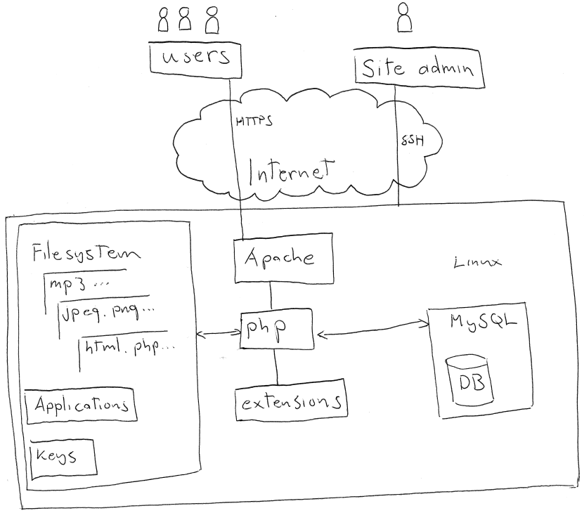
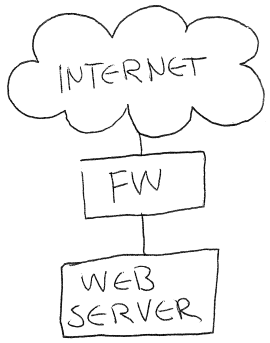
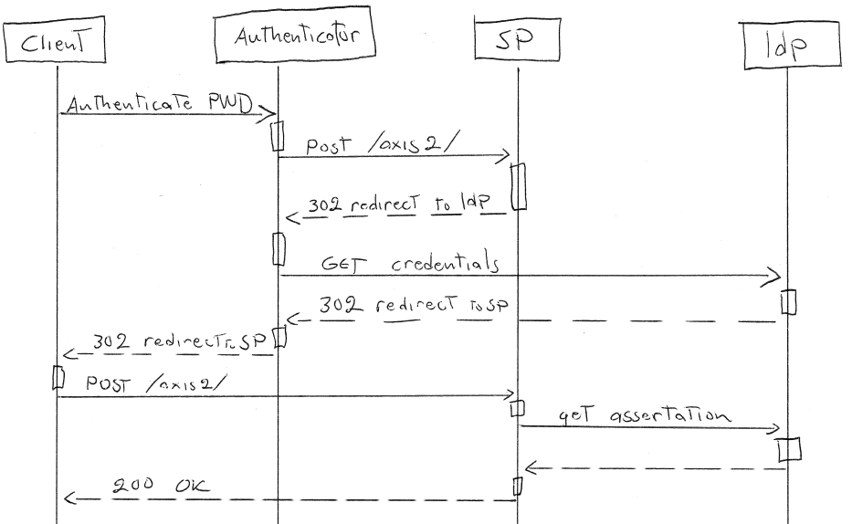

In the previous sections of the course we have shown how input checking is
important and introduced some tools for Fuzzing the input. As a reminder, dumb
fuzzing was based mainly on random inputs on a black box and smart fuzzing
relied on test harnesses on the target application. What happens inside an
application when the input is given to it? If one follows the target
application with a debugger one can easily see that data is being copied and
modified here and there inside the program. One can even say that data is
always moving (most of the time anyway). One should also remember that the data
may be code and it may be accidentally interpreted if there's a vulnerability
in a parser.

The key to understanding how a complex piece of software works is drawing a
picture. You might have heard about a saying that goes "a picture is worth a
thousand words". Humans cannot remember many things at a time and most systems
have legions of parts and some of them are produced by a third party. It helps
if the developers and the security analysts can sit down and draw while
discussing about the system and what it is doing. Resolving questions like
"_how_" and "_exactly what_" are very effective while one draws on whiteboard
and others comment.

<text-box variant=emph name="How to draw">

You might be tempted to start using a drawing apps for this task. You get nice
pictures out of these but one tends to spend time tweaking with the app rather
than drawing. So paper will be enough. However, whiteboard is the best option
as you can easily erase and redraw parts of the diagram. If a nice looking
image is needed then it is easy to copy it from the whiteboard and then use the
drawing apps.

</text-box>

## Creating diagrams

### What to draw and how

The diagrams presented in this section are more conceptual than technical as
there is no need for all the details and the form of it is free. For example,
[class diagrams](https://en.wikipedia.org/wiki/Class_diagram) are not useful
with threat analysis as they do not relate to processes, i.e. run-time
encapsulation. Although some information from the classes is useful, such as
serialization of data, but it can be expressed easily by writing it to the
diagram.

### Data Flow Diagram

Data Flow Diagrams are graphical representations of the data flow through the
system. It is  used to get an overview of the system but can be used to
visualize the data processing. From the diagram it should be visible what kind
of information is going in and out of the system. Below is a very simple one
physical machine LAMP website example.

<text-box variant=emph name="Example of DFD usage">

Danny Dhillon writes about  Developer-Driven Threat Modeling in IEEE Security &
Privacy issue in  Jul-Aug
2011 [[link]](http://www.infoq.com/articles/developer-driven-threat-modeling).
In this article he tells how they use DFDs and how they scale up.

</text-box>

The following image is related to the next question.

<quiz id="8fd9a0a6-a325-5976-8eca-2f6c82d98f6b"></quiz>

### Message Sequence Chart

What if there are more communicating entities and/or more complex protocols
with more messages. The Message Sequence Chart  is an interaction diagram which
is used to illustrate communication system components and their message
interchange flows. In MSC all the entities have their own vertical line and
between them the messages are drawn as horizontal arrows between the entities.
In MSC time runs from top to bottom. Below is an example of a Axis2 web service
SSO messaging with Shibboleth.

## What to include in the diagram

We just got off from saying that there is no need to be fully formal and there
is no need to draw unnecessary details into the diagram. Hmm, so what to draw
into the diagram? What kind of information is then needed?

There might be available architectural images of the whole system and they are
tempting starting points to use in the analysis but actually they are not.
These images might come from design team and possibly they are even for
marketing purposes and should not be used. In real-life what the system exactly
does is not always clear.

When starting with the architectural threat analysis the people around the
table rarely agree on what everything in the system does. Also the fact that
the developers use abstractions that are helping them to work efficiently but
the abstractions might mask what is really happening in the software or give
wrong assumptions on the workings of the system. Sometimes the design plan has
been changed and the changes are not translated into the system itself or the
system contains undocumented debugging features, etc. The best way is to start
from the empty whiteboard, draw the overall architecture, and refine it in
steps. These steps include many questions of "how" and "what exactly" and they
are repeated multiple times. How many times depends on the situation but the
point is to arrive in a place where all around the table agree that the
security analysis level is meaningful.

So what to draw then? Keeping in mind that the result should explain the system
in sufficient detail. This may differ case by case but at least the following
should be found from the diagram.

Let's start from the way how the attacker interacts with the target system. The
data needs to flow to and from the attacker to the system. This is called an
interface, which is a place in the system that crosses a boundary. A security
boundary is a barrier between processing blocks that is enforced externally,
for example, OS controls that a process cannot read another processes' memory.

<text-box variant=emph name="Actors">

Sometimes when drawing DFDs the actors are forgotten. However, the data flow
sometimes starts and ends at the user and that user could be an attacker and so
an important part of the DFD. Also do not forget the administrators and their
administration interfaces.

</text-box>

The first letter in DFD stands for data, but what do we want to know about it?
It is good to know three things about the data: where did it come from, where
is it going, and what it is. First, where did the data come from? If the data
came from outside it can be attacker controlled. Second, where is the data
going to? This helps in figuring out the places in the system that may have
potential attacker controllable parts. Some good follow-up questions to this
are how is the data transported and where is it going to be stored. It makes a
huge difference that the access rights for important files are correct or that
the database users are correctly setup. Third, what the data is? Depending on
the data it might need more or even more security services. The data may
contain information that needs to be kept safe. Information such as social
security numbers or other data that needs to be kept private or otherwise
sensitive data such as credit card numbers. Normally data is the content in the
system but also cryptographic keys, certificates, and configuration files of
the system should be considered as data.

The DFDs are full of blocks or sometimes bubbles (also known as bubble charts).
These blocks handle the data processing and they have to be reduced to the
point in which they contain a single decision on the data. This basically means
that you are going as deep as needed until all ambiguity is removed from the
block. Important things to draw with the blocks is information such as the
implementation language. Also where did the code or block come from might be of
interest as applications written today reuse existing code and are based on
frameworks. From the diagram it should be easy to understand what framework and
what version was used and what are all the static and dynamic libraries.
Moreover, plug-ins and extensions should not be forgotten. What not to reduce?
When you find a processing block over which you are not developing or have no
control over otherwise. For example, the browser can be left undrawn if the
system is purely server side application. However, the data flow to the browser
has to be drawn.

The underlying technologies are one point of interest in DFDs. Virtual
machines, load balancers and such should also be drawn in. Basically anything
that handles the data in a way or another.

<quiz id="a8877f72-b7c7-5445-9548-307c3809ea13"></quiz>

<quiz id="1cedbfed-f361-58ae-a8ab-fce5e7537913"></quiz>

## Boundaries

The DFDs are full of boxes but what are they and what do they contain?  In data
flow analysis, the boxes are boundaries that act as barriers between processing
blocks. Some of the typical boundaries:

- Machine boundaries
- Containing boundaries
- Processes

Barriers are usually externally enforced. Security boundaries are nested
meaning that the physical machine is the first boundary and for example the
virtual machines running on that machine are boundaries and processes running
on those virtual machines are boundaries, etc. As mentioned before, in OSs
processes cannot read other processes memory (this is a boundary only if the OS
or the filesystem really enforces access control). Which would mean that
threads do not have their own security boundaries as they share memory with
their parents. Somewhat similarly same owner's processes can access the same
files in the filesystem (not a boundary if looked from the filesystem
point-of-view).  Machines and virtual machines are also boundaries as processes
do not move between machines or virtual machines.

<quiz id="9086dc05-7d65-550b-bb17-bb8ddb3eab26"></quiz>

Containing boundaries are boundaries that do not come from the system but are
usually created on purpose. Containing boundaries are isolated from the hosts
execution environment in some way. For example a containing boundary can be a
chroot jail, a Mandatory Access Control system (MAC), a sandbox or an
operating-system-level virtualization system.

[Java VM](https://help.sap.com/saphelp_nwpi711/helpdata/en/55/c602ccca7441afa6d00e088e4011de/content.htm)
and [seccomp](https://en.wikipedia.org/wiki/Seccomp) are examples of sandboxes.
A quarantine sandbox looks for malicious files in the confined area and
determines if it is something bad. This sandbox is more like a brief period in
which the files are scanned and then released. Operating-system-level
virtualization can also be thought as a sandbox. For example,
[Docker](https://www.docker.com/) creates the illusion of containers being
their own machines by taking advantage of
[chroots](https://en.wikipedia.org/wiki/Chroot), [resource
namespaces](https://en.wikipedia.org/wiki/Linux_namespaces) and [resource usage
limitations](https://en.wikipedia.org/wiki/Cgroups).

AppArmor and SELinux are examples of MAC. With them you can harden the
processes running on the same OS and enforce detailed system checks whether the
processes have the correct rights to access resources. One might ask why to use
this kind of hardening in addition to the built-in OS access control but the
reason is quite simple. When operating normally the OS keeps the application
(their processes) at bay but if an attacker finds a way to exploit a weakness
in the process and tries to access resources it is not meant to read then the
MAC will not allow the operation. For example, the access control rules can
specify which files, devices, and system calls are allowed and which not.

If an attacker is able to bypass a boundary, it usually is safe to assume that
the attacker is in control of all the access rights and what happens inside
that boundary. While accomplishing this may not be straightforward, it makes
sense to assume the worst has happened. Moreover, this is a good incentive to
keep your system up-to-date and hardened. For example if the attacker somehow
gains access to a JBOSS Application Server running on the machine the attacker
gains control over all the applications running on it or if the attacker gets
the control of the kernel of that server the attacker gains control of the
whole machine (including the virtual machines on the physical machine).

## Termination

All the data flows have to end somewhere. Termination is an important concept
as always when the data flow is parsed or acted on is a possible place for a
attack. These termination points are the places where the target system is
exposed to external influence. For this reason it is important to understand
where each data flow terminates.

Protocols are one part of interest in the data flow analysis. Typical data
flows are using networking protocols such as, IP, UDP, TCP, SSL, TLS, HTTP
(Ethernet is not mentioned as it is not end-to-end protocol instead it
terminates switch by switch and connects only devices in close proximity).
These protocols are stacked on top of each other and all of them have their own
task in the networking stack (Please see the [OSI
model](https://en.wikipedia.org/wiki/OSI_model)). IP is the responsible one to
getting the packet routed from the source to the target, Next layer is the
transport layer which handles things such as flow control, reliability,
multiplexing with either UDP or TCP depending on what kind of traffic
characteristics are needed. Protocols such as TLS are used to provide
confidentiality and integrity on top of TCP (DTLS on top of UDP). On top of
that protocols such as HTTP and CoAP are used to move web page requests and
responses. On top of there may still be application level protocols that are
using all of the above to transport their protocol messages.

But where do these protocols terminate or do they just pass through? Data
passing through if it is passed through without touching it (i.e. no parsing,
filtering, etc.). These points are not part of the attack surface. Most of the
IP routers and such belong to these devices. Anything that looks into the
traffic, be it a proxy or a load balancer terminates the flow of that layer and
makes it a possible point of attack. From a black box it is hard to determine
if it is passing through the data or is it actively "tampered" with. Sometimes
for some boxes the "looking into what it is doing" is impossible and these
should be treated as untrustworthy termination and new traffic points.

<quiz id="ef7aeccf-f5fe-5504-ad69-44f4f4e551bf"></quiz>

## Taint Analysis

Taint analysis is a form of information flow analysis that is used to track
untrusted input through the system (the term originates from perl). A flow is
an operation or set of operations that operate on value x to derive another
value y. If the x here comes from untrustworthy source it is tainted and it is
given a tag or a label. This is done to all user data. These tags allow the
tracking the influence of the objects through the target application. Tainting
also propagates and is transitive as when a tainted object is used to derive
yet another value that value is then also tainted.

What can be done with tainting? We can track user data and see if non-trusted
data can reach locations that it should not, i.e. which boundaries does the
tainted data end up in. For example if non-trusted data reaches privileged
location it is possible that it may cause buffer overflows, XSS, etc. Taint
analysis is nice as it can detect that something is wrong even with unknown
attacks. In taint analysis all statements are checked if there is tainted
objects included and if there is the execution is halted.

The taint analysis phase of threat analysis follows all the data flows and all
layers of flows and can identify the components that process the data.  Taint
analysis is one of the easiest ways to understand which components in the
system are the ones exposed most to the attacker generated data. The output of
the taint analysis is a good list of candidates for fuzz testing (discussed in
earlier part). Other analysis can also be performed on the components in the
list.

<text-box variant=emph name="The checker framework, type based taint analysis in Java web applications">

The tainting can be as simple as associating a boolean value to a piece of
data. Although sometimes more data may be helpful, for example, it may be
useful to be able to distinguish the source of the data. Actions that could be
taken when for example a tainted piece of data tries to leave the system are
for example, logging, stopping the transfer of the data, or even halting the
program.

[Checker framework](http://types.cs.washington.edu/checker-framework/) is one
open source tool that enhances Java's type system that it is more expressive.
With Checker you can annotate types and source files and detect and prevent
errors. They also provide a small
[tutorial](https://types.cs.washington.edu/checker-framework/tutorial/webpages/security-error-eclipse.html)
to get you started with the tainting checker.

</text-box>

<quiz id="c532fc92-05d5-5466-83d8-2ad73c916171"></quiz>

## Data lifetime

Data lifetime is very important to think about when implementing software. The
lifetime depends on the fact on who allocates the memory for that piece of data
and where does it end up. The memory can be allocated from different places,
from Kernel, system applications, and from user applications. This means
different things for the lifetime of the data and where it ends up. The data
may end up in places such as the kernel, any application, system swap, or
hibernation storage.

The problem of minimizing the lifetime of a piece of data is hard. One can
follow two different approaches the coarse-grained and fine-grained control for
propagation. First, in coarse-grained control one cannot determine when the
data is for example swapped out of the memory or have little control in core
dump situations (written to a log file). Against the swapping one can try to
protect by encrypting the swap with
[dm-crypt](https://wiki.archlinux.org/index.php/Dm-crypt/Swap_encryption) or
similar if possible or by explicitly locking the data to memory which is
possible for example in C by using _mmap_ and _mlock_. If the core dump is
setup incorrectly the contents may be readable to unprivileged users and there
is a risk that the dump contains sensitive information. Also in situations
where the dump is sent to another machine, for example with netdump, care must
be taken that the dump is not sent with "NETDUMPKEYEXCHANGE" variable set into
_none_. Second, the fine-grained control relies on programmers. Depending on
the language it may not always be possible but, for example in C this would
mean removing _memsets_. More information of this and related things can be
found from the [Secure Coding
Guidelines](http://www.oracle.com/technetwork/java/seccodeguide-139067.html#2)
for Java SE.

<quiz id="277afb93-21f4-5ade-be42-68875c5aeaaa"></quiz>

During this course, we have taken an introductory tour to securing (web) software. In the course project, some of this knowledge is taken into use. Stay tuned.
