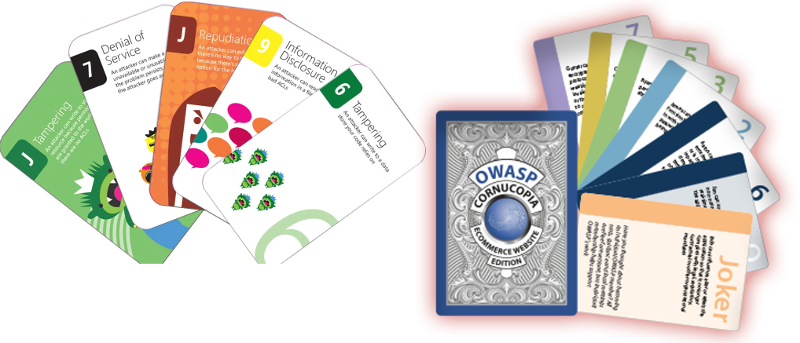

The importance of cyber security in our everyday lives cannot be  denied. Security has become a complex topic as it needs to cover most aspects of our lives. When developing an application the threat modelling is sometimes underestimated, although it should not be and we have seen devastating results of it. To enhance the life-cycle of the application the foundation needs to use processes such as threat modelling. In which the security experts and developers, determine what could be a possible threat to the system, prioritize them, and come up with a mitigation plan for the threats.

During threat modelling the system is put to analysis and decomposed. As a recap of what has been covered: the decomposing of the target application in order to determine and identify system boundaries, components or assets of the target application. In addition data flows between the application components and identification of sensitive data was discussed.

Now that the data flows and stores have been identified one has to consider the security services they need. As earlier mentioned not all data flows require all types of security services available. For example, some data may be public and only needs to be integrity protected to verify that it is not tampered with. One could use the simple CIA triad, Confidentiality, Integrity and Availability as the starting point with the needs for each flow and storage.

<quiz id="aa1449e2-48a7-59cc-ba26-babd5e0be72e"></quiz>

We have already briefly mentioned STRIDE and DREAD but here we delve deeper into the topic and discuss how they can be used to categorize and prioritize threats. Neither one is exhaustive, but  provide good structures for determining the type of a given threat.

## The DREAD risk assessment model

DREAD is a mnemonic checklist for prioritizing threats based on their severity, and stands for _Damage, Reproducibility, Exploitability, Affected Users,_ and _Discoverability_, all of which are fairly self-explanatory. A scale from 0-10 is usually used in all categories. Finally a risk rating can be calculated by averaging the values like so, Risk = (D + R + E + A + D) / 5.

However, some DREAD ratings can be argued over. For instance, reproducibility is not very useful in cases where you would drop a table and it would not work again (on that same table). This would result in low number in the rating as it can be done only once but the effects would still be great. Or discoverability is hard to rate as you would have to know what the attacker knows and this leads to the case where this rating is commonly set to 10 on the grounds that any threat will eventually be discovered and the smart attacker is out there. Similarly can be argued over with the discovery, there has been a fair amount of discussion concerning discoverability, and whether encouraging security professionals to minimize discoverability would in turn favor the deprecated approach of security through obscurity.

<text-box variant=emph name="Straying away from DREAD">

Adam Shostack, who was involved in security design analysis techniques at Microsoft, has said on the Microsoft Security Development Lifecycle (SDL) [forum](https://social.msdn.microsoft.com/Forums/en-US/c601e0ca-5f38-4a07-8a46-40e4adcbc293/do-you-use-dread-as-it-is?forum=sdlprocess) that even Microsoft which invented the ratings are now using different methods evaluating the threats. However, DREAD is still in wide use and useful as a starting point. However, this is all we are talking about DREAD at this point.

</text-box>

## The STRIDE Threat Model

The STRIDE Threat Model is a useful checklist of questions that can help in the threat-modelling of an application. "STRIDE" is an acronym for the following threat categories: _Spoofing, Tampering, Repudiation, Information Disclosure, Denial of Service,_ and _Elevation of Privilege_.

As in the start we hinted on the fact that the mnemonic threat lists such as STRIDE are good starting points and they work as good starting points in the discussions for the data flow analysis. If you consider that in the last part dissected the application to its data flows and identified what protocols are used and what data content is in the flow you should be ready for technical discussion about the series of questions the STRIDE stands for for all of the identified flows.

Easiest way to get started is to start from higher levels and work your way down as needed. Sometimes the decisions on the higher level will make the lower layer protocol issues go away or change them completely. For example, sometimes the data is transported with different protocol stacks in different parts of the system and each of these stacks have to be treated separately. However, if you can provide end-to-end security services on the application level you change the needs on the lower levels.

The more experience the team has the less you need these mnemonics. But here we still give a brief examples of what the STRIDE stands for:

_Spoofing_ covers cases where someone is illegally accessing a system using another user’s authentication information. The main question here is that how the components can ensure that the other end of the data flow is the "correct" end or how to know where did that end get that data. For example, websites seldomly care about the user, but for the user it may make a difference that the website is the "correct" website and not a spoofed one.

_Tampering_ covers cases such as unauthorized changes made to persistent data, whether inside a machine or in the transport. For example, does it matter if the data comes in out of sequence or as incomplete?

_Repudiation_ has two sides to it. First the threats that concern the users who deny their actions. For example, a user performs an illegal operation in a system that lacks the ability to trace the prohibited operations. Sometimes this is desirable way, consider the privacy preserving possibility of plausible denial. Second, non-repudiation which refers to systems ability to counter the denying users. For example of non-repudiation a client can buy something and then claim not. For this reason users might need to sign a receipt upon receiving the item and the vendor can use the signed receipt as evidence of the transaction. The system needs to keep audit logs for this to work and it must be ensured that they are stored in a way that they cannot be tampered with.

_Information Disclosure_ covers the exposure of information to unauthorized individuals. This category of threat can also occur within a machine or during transport. The main questions to ponder are things such as who are the once authorised to see the data or how can we determine who has seen it. When considering storing the data there might be long-term confidentiality needs and that might pose issues for example to encryption choices today. Something that is hard to crack now might not be in the future.

_Denial of Service_ refers to all the cases in which the server or service is made unavailable for the authorised users. You must protect against certain types of DoS threats simply to improve system availability and reliability.

Lastly, _Elevation of Privilege_ is a threat type in which an unprivileged user finds a way to gain sufficient privileges to compromise the system. Elevation of privilege threats include those situations in which an attacker has effectively penetrated all system defenses and become part of the trusted system itself, a dangerous situation indeed.

<quiz id="4beb05b9-20b1-59ae-bd13-4fd265497020"></quiz>

## Applying STRIDE

As an example one can consider a webstore that stores personal profiles of the users. The following are what kind of threats one can find but in no mean is not definitive list of possible threats.

- A malicious user uses man-in-the-middle to view and/or tamper with profile data on route from client and server or between components in the system.
- A malicious user accesses or tampers with the profile data directly in the database. 
- A malicious user learns how to act "on behalf of" the user by mimicking certain Lightweight Directory Access Protocol (LDAP) behaviour.
- A malicious user tampering with the data on the site
- A malicious user launches a DoS attack against some part of the system and renders the system inoperable. For example denying access to database serving the user profiles.
- A malicious user deletes or modifies the audit logs.
- A malicious user launches a DoS attack on the target and crashes it and takes the place of the target.

## Gamification of the security analysis

Analysis can be tedious work but it does not have to be. What about if it was a
game and the participants where the developers, architects, testers, etc in the
company. Reserve a room, some catering and get prizes. Oh, and have some fun
while doing the analysis.  There are at least two major contestants on this
field and they are both card games. These games encourage the participants to
think creatively and out-of-the-box about the threats. First, there is the
Microsoft Elevation of Privilege (EoP) Card
[game](https://www.microsoft.com/en-us/download/details.aspx?id=20303)  which
is based on STRIDE. Second, there is the OWASP Cornucopia card
[game](https://owasp.org/www-project-cornucopia/) which is based mostly
on OWASP Secure Coding Practices - Quick Reference Guide
([SCP](https://owasp.org/www-pdf-archive/OWASP_SCP_Quick_Reference_Guide_v2.pdf)).
Cornucopia has more relevance to the web applications than EoP.

## Why to prioritize

Now we have some threats, but what to do with them? This part can be called the risk analysis, as you have to decide what is the amount of risk they pose. All threats do not pose the same amount of risk.

The prioritizing of the threats can be critical for many reasons. In some case there really is no good (or any) fix for the problem. Sometimes business comes in the way. Sometimes the business might decide that they are willing to take the risk as they believe they can tolerate a certain level of risk. But the main thing here is that the situation is always different and it involves a calculation of benefit. Or more precisely is it worth the effort and cost to fix the issue. The problem might be fixable in limited time but costs a large sum of money but the likelihood of exploitation is low.

With the prioritization we can start the fixing job from the highest payoff tasks. There is basically just two questions: how likely it is that the sh\*t hits the fan, and how large of clean job you have in your hands after it. Sometimes these questions are skipped and it is just assumed that everything has to be fixed. There may be situations where you find a problem but it is not applicable into the current operating scenario or environment. But remember sometimes a threat does not look that dangerous on the first glance but could still hit the fan and land you with a massive cleaning task. Care has to be used and common sense also.

In essence you need to decide what is the cost to mitigate the problem and is it greater that the probability of it happening. This means that Risk is impact times the probability of it happening. Here the impact is easy to estimate, the probability not so easy and is usually a guess. How this is done in reality differs from case to case but it is in the end driven by the organisation and possibly some sort of risk management process in that organisation.

<quiz id="cbc8fc51-6e76-57eb-a459-0806e7c1783a"></quiz>

During this first part of the advanced topics course, we have taken the further steps into understanding architectural analysis. The next part will look into the purpose of log files and how to manage them.
