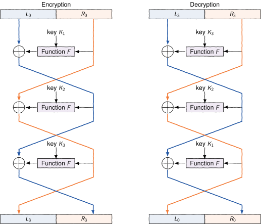
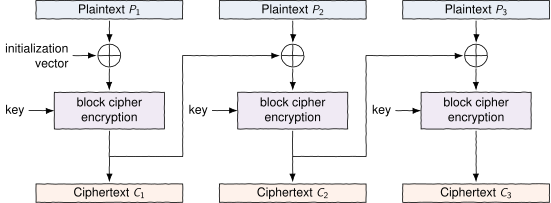
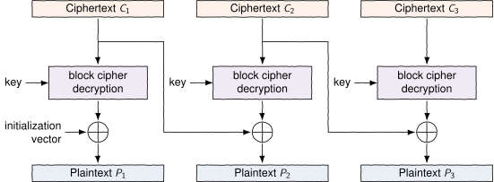

_Cryptanalysis_ is the study of cryptographic algorithms and methods. The basic goal is to _break_ cryptographic algorithms in one way or another. For example, the attacker may have acquired knowledge of some cryptotexts and the corresponding plaintexts. Then he tries to use this information for finding the used key. In another setting, we assume that the attacker has only some cryptotexts based on which the key should be found. It is always assumed that the attacker knows all details of the encryption and decryption processes, only the secret key is not known. If this cannot be assumed then the encryption method is considered to be very weak.

Let us take a look at the substitution cipher. Now every occurrence of the letter &rsquo;e&rsquo; in the plaintext is encrypted as the same letter in the cryptotext, let's say &rsquo;&Aring;&rsquo;. Because &rsquo;e&rsquo; is the most common letter in the English language, &rsquo;&Aring;&rsquo; should be one of the most common letters of the cryptotext. So we may assume that the common letters in the cryptotext correspond to common letters in the language of the plaintext and use this information for making educated guesses about how each letter is encrypted. This cryptanalytic approach is called _frequency analysis_.

<programming-exercise name="Frequency attack" tmcname="part3-04.frequency" course="Advanced Topics">

Implement a simple frequency attack against a substitution cipher.
Complete `decode` in `decode.py`. The function is given a string `ciphertext` and dictionary `frequencies`,
where `frequencies[c]` is a float indicating how frequent is the letter.
The output of the function should be a string (not byte array).

You can assume that `ciphertext` and the output do not use capital letters.
Non-characters (spaces, enters) are not changed.

Furthermore, you can assume that the frequency rank in `frequencies` matches
the frequency rank in the message.  That is, the most common letter in
`frequencies` will be the most common letter in the message.

Hint: `string.ascii_lowercase` and `islower()` can be handy.


</programming-exercise>

The same approach cannot be used against OTP. If the key is chosen randomly, both 0 and 1 appear as often in the cryptotext, on average. This happens regardless of how common 1 is in the plaintext. In fact, any cryptotext could result from any plaintext with a suitable key. Assume the known cryptotext bit is C. Now the corresponding plaintext bit could be either C (which happens if the key bit is zero) or 1-C (which happens if the key bit is one). Therefore, knowing the cryptotext does not provide any new information about the plaintext to the attacker. This means the OTP is _unconditionally_ secure.

For the OTP, we applied the setting where the attacker knows only the cryptotext. If the attacker knows both the cryptotext and the corresponding plaintext, then he can easily recover the used key. However, breaking OTP in this setting is not relevant because the recovered key is not used to encrypt anything other than the plaintext that the attacker already knows.

## Modes of operation

A block cipher, like AES, is used to encrypt blocks of a certain size. What should be done if the message is longer than that size?

The simplest way to encrypt a long message is to take the first block, encrypt it using the key to produce the first cryptotext block, then take the second block, encrypt it using the same key to produce the second cryptotext block etc. This approach is one of the [block cipher modes of operation](https://en.wikipedia.org/wiki/Block_cipher_mode_of_operation), called _Electronic Codebook_ (ECB). It is the simplest way but often could be broken by frequency analysis. The attacker notices if you encrypt the same plaintext block twice because the two cryptotexts are also the same. This happens, for example, if plaintext contains some commonly used short pattern, like 'OK'.

Other modes of operation avoid this problem by using extra input in addition to plaintext and key. For instance, previously computed cryptotext blocks or _counters_ could be used for this purpose. Our HTTPS example (`TLS_ECDHE_RSA_WITH_AES_256_GCM_SHA384_256 bit keys,TLS 1.2`) makes use of the AES algorithm in _Galois/Counter Mode_. The key length is 256 bits.

The next 3 exercises should be done in order.

<programming-exercise name="Feistel ciphers" tmcname="part3-05.feistel" course="Advanced Topics">

Feistel ciphers are used as building blocks in constructing many known block ciphers.

In feistel cipher you are given a block cipher $F$ that can encrypt a message of length $m$.
You are also given $n$ keys $(K_1, \ldots, K_n)$.

Feistel cipher is a block cipher encrypting messages of $2m$.
In the beginning, the original message is split in two halves, $L_0$ and $R_0$, each of size $m$.
Then $n$ iterations are done with updates

$$
\begin{aligned}
L_i & = R_{i - 1}  \\
R_i & = L_{i - 1} \oplus F(R_{i - 1}, K_i). \\
\end{aligned}
$$
Here $L_i$ and $R_i$ are the two halves of the ciphertext after _i_th round.

The final cipher is $L_n$ followed by $R_n$.

The decryption works in similar fashion but in reverse order.
Note that we can rewrite the update equations as
$$
\begin{aligned}
R_{i - 1} & = L_i \\
L_{i - 1} & = R_i \oplus F(R_{i - 1}, K_i) = R_i \oplus F(L_i, K_i). \\
\end{aligned}
$$
In other words, we can start from $L_n$ and $R_n$ and reverse all the way back to $L_0$ and $R_0$.



Implement Feistel cipher: complete encrypt and decrypt in `src/feistel.py`.
The function $F$ is a class parameter `self.roundf`, and the keys are an array in the class parameter `self.keys`.

You can assume that the block size $m$ of $F$ is 4.


</programming-exercise>


<programming-exercise name="Cipher block chaining (CBC)" tmcname="part3-06.cbc" course="Advanced Topics">

Feistel cipher in the previous exercise can only handle blocks of $m = 8$. Next we are going to extend the cipher
to handle messages of any size.
We will use cipher block chaining (CBC).

The first step is to make sure that the message length is a multiple of 8.
This is done with PKCS#7 padding. In such padding, message is padded with extra bytes 
so that the message length is a multiple of 8. The value of the bytes are equal to the added bytes. If the message length
is already a multiple of 8, then 8 bytes are added with a value of 8. In other words, padding will be one of the
following lines.

```rest
01
02 02
03 03 03
04 04 04 04 
...
```

(note that the numbers are byte values not ascii integers)

The next step is to encrypt the message.
Here the message is divided into blocks of length 8, $P_1, P_2, \ldots$.
We also set $C_0 = iv$, where $iv$ is an initialization vector, an array of length 8, provided as a parameter.
The encryption proceeds iteratively with
$$
C_i = encrypt(P_i \oplus C_{i - 1}),
$$
where $encrypt$ is our block cipher.
The final cipher message is $C_1C_2C_3\ldots$. Note that we do not include $C_0$ here, the initialization vector is sent separately.



To decrypt, note that
$$
P_i \oplus C_{i - 1} = decrypt(C_i)
$$
which we can rewrite
$$
P_i = decrypt(C_i) \oplus C_{i - 1}.
$$



Complete Cbc class by implementing `encode` and `decode`. Remember to add and remove the padding.
Note that you will also need the fully-implemented Feistel class from the previous exercise.

Hint: you will probably find the xor helper function helpful. Do not forget to add the pad even if the message length is already a multiple of 8.

</programming-exercise>

### Padding oracle attack

Padding oracle attack shows that a tiny amount of additional information can be enough to break the cipher.

Earlier versions of CBC decipher implementations would return an error message to the sender if the padding of the sent message was correct. 
This information, assuming that we have access to submit our own messages to the decipher, is enough to break CBC encryption!
Furthermore, the breakage doesn't depend on the underlying block cipher.

Assume that we have an oracle that given a ciphertext will tell whether the decrypted message has a valid padding.
Note that we don't get to see the decrypted message, we only observe whether the padding is valid.

Assume that we have two blocks of ciphertext $C_1$ and $C_2$, each of length 8.
Write $A = decrypt(C_2)$. We know from previous exercise that
$P_2 = C_1 \oplus A$.
If we can solve $A$, then we can solve $P_2$.

Let us focus on solving the last byte of $A$. There are 256 possible values for $A[8]$. Consider 
256 different ciphertexts of form $(M_i, C_2)$, where $M_i$ is an array of zeros, except for the last entry where $M_i[8] = i$.
Let $Q_i = M_i \oplus A$ be the 2nd block of the decrypted message $(M_i, C_2)$. 

Note that $Q_i[8]$ is different for every $i$; there is an index $c$ for which $Q_c[8] = 1$.
If we know $c$, then we can deduce $A[8]$ since $A[8] = c \oplus 1$.

We don't know $c$ but we know that, since $Q_c[8] = 1$, $(M_c, C_2)$ has a valid padding!
So to find $c$ we can test every $(M_i, C_2)$ with an oracle to see which ciphertexts produce a valid padding.

There is a small complication as the oracle can find multiple messages with a valid padding. 
For example, if $Q_j[7] = Q_j[8] = 2$ or $Q_j[6] = Q_j[7] = Q_j[8] = 3$, then $(M_j, C_2)$ has a valid padding.
Note that $Q_i[7]$ does not change as we vary $i$. This means that the oracle can find at most 2 messages with a valid padding (can you see why?).

This gives us the following approach. We test 256 ciphertexts $(M_i, C_2)$ to see which ones have valid padding.
If there is only one, then we have found $c$ and we can solve $A[8]$.
If there are two, say $c$ and $j$, we need to figure out which one is which.
This can be done by changing $M_c[7]$ and $M_j[7]$ to a different value (for example by xoring with 1).
This will change the 7th byte of the decrypted message. 
Let $M'_c$ and $M'_j$ be the modified ciphers. Then $(M'_c, C_2)$ will still produce a valid padding while
$(M'_j, C_2)$ no longer has a valid padding since the last and the second last byte in the decrypted message no longer match.
In summary, we can find $c$ and solve $A[8]$.

Once we have solved $A[8]$ we can move to solving $A[7]$. This is done by setting $M_i[8] = A[8] \oplus 2$
and $M_i[7] = i$. Using the oracle we can find the index $c$ for which $Q_c[7] = A[7] \oplus c = 2$, resulting in a valid padding.
Note that, unlike in the case of the last byte, the oracle will only find the index (can you see why?).
Finding $c$ allows us to solve $A[7]$. We can now move to to $A[6]$ by setting $M_i[8] = A[8] \oplus 3$, $M_i[7] = A[7] \oplus 3$,
and $M_i[6] = i$. We continue until we have solved $A$, which will give us $P_2$.

If the cipher has more than two blocks, say, $C_1, \ldots, C_n$ we can decrypt each individual block, say $C_j$, by running the previous
procedure for each pair $(C_{j - 1}, C_j)$. 


<programming-exercise name="Padding oracle attack" tmcname="part3-07.paddingattack" course="Advanced Topics">

Implement padding oracle attack by completing the functions `test_value` and `decode_block`.

The function `test_value(b1, b2, index, oracle)` finds out which values of `b1[index]` will produce a valid padding.
Use `oracle.isvalid` to test the ciphertexts. If there are multiple values with valid padding, then `test_value`
should select one of the values by modifying `b1[index - 1]`.

The function `decode_block(b1, b2, oracle)` should decrypt the second block by manipulating `b1` and using `test_value`.

You will need to copy your implementations of Feistel cipher and Cbc class.

_Hints:_

1. There is a lot of xorring here, be careful and perhaps spend some time with pen and paper.
2. When solving 7, 6, 5, ... bytes of the block make sure that you set up the trailing padding bytes correctly.
3. Don't forget that ultimately we are looking for $P_2$ and not $A$.

</programming-exercise>
