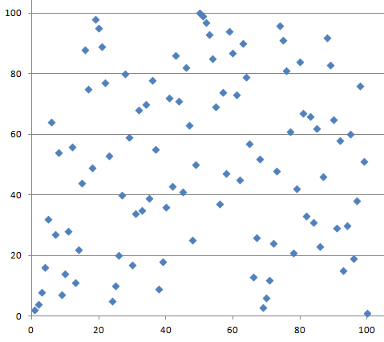
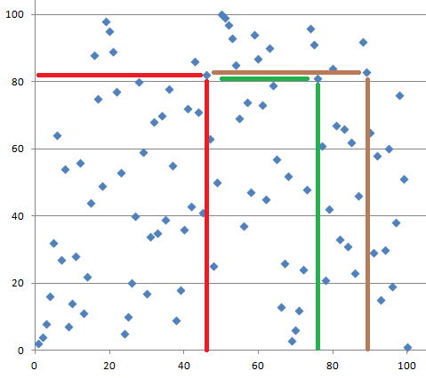

In symmetric encryption the same key is used both for encryption and decryption. In public key cryptography we have a separate key for encryption and another one for decryption. This makes sense if it is hard to determine the decryption key even if the encryption key is known.

If this is the case then you could tell everybody how to encrypt messages they want to send to you but still only you would know how to decrypt these messages. This explains the name: encryption key could be made public while the corresponding decryption key still remains secret.

Typically the keys are longer and the algorithms are slower in public-key cryptography than in the symmetric encryption. But with public-key cryptography you are able to do things which cannot be done with symmetric encryption.

The above mentioned possibility for even strangers to send confidential messages to you is one such thing. _Digital signature_ is another such thing: Using public-key cryptography it is possible to _sign_ messages electronically and to _authenticate_ users and their messages.

Let us denote
by $a \mod b$ the _remainder_ when $a$ is divided by $b$. The $b$ here is
called the _modulus_. For example, $12 \mod 5 = 2$ and $77 \mod 8 = 5$.

Also, we make use of _prime_ numbers, shortly _primes_. An integer, larger than 1, is a prime if it is only divisible by 1 and itself. For example, 7, 101 and 7823 are primes but 6, 15 and 100 are not.

Given integers $a$, $b$ and $c$, it is easy (at least in principle) to
calculate $a^b \mod c$. This _modular exponentiation_ is relatively easy to do
even when the integers $a$, $b$ and $c$ are very big.
With big $a$ and $b$ the power $a^b$
becomes huge. Luckily we do not have to compute this huge number at
all. Instead, it is possible to compute the remainder for each intermediate
value before continuing. Let us take a simple example: $a = 2$, $b = 60$,
$c = 1003$. Now $a^b = (2^{10})^6$.

We first compute $2^{10}=1024$. Then we take the remainder of this intermediate
result: $1024 \mod 1003 = 21$. Next we raise 21 to the power of 3. The result
is 9261. Taking the remainder again with the modulus 1003 we get 234. The final
step is to raise 234 to the power of 2: the result is 54756. Taking the
remainder again we get the final result: $a^b \mod c = 594$.

On the other hand, when arbitrary integers $a$, $c$ and $d$ are given, it is
very hard to find an integer $b$ such that $a^b \mod c = d$. This problem is
called the _discrete logarithm problem_. We use the notation

$$
\log_a d \mod c = b.
$$

Because modular exponentiation can be done relatively fast even for large numbers but the inverse problem of finding the discrete logarithm becomes very hard for large numbers, modular exponentiation with large numbers is an example of a one-way function.

Let us take a closer look at the discrete logarithm with small numbers. We choose $c = 101$ and below see a graph depicting $2^x \mod 101$.

Note that the graph is not smooth and it is not growing like the &rsquo;normal&rsquo; exponential function defined for real numbers. Instead, the graph seems to make random-looking moves.

<quiz id="265fda67-3a96-52c5-954b-d6d3b26cc9ff"></quiz>

A _key agreement protocol_ is a method for two parties, say Alice and Bob, to agree on a shared secret key over an insecure channel, but still in such way that nobody else who is eavesdropping on the channel is able to learn the shared secret. An example of such method is _Diffie-Hellman key agreement protocol_.

The Diffie-Hellman key exchange begins by Alice and Bob agreeing on a modulus
$p$ and a number $g$. Then Alice picks a random number $a$ and
sends Bob the number $g^a \mod p = u$. Similarly, Bob picks a
random number $b$ and sends Alice the number $g^b \mod p =
v$. Now Alice can calculate $v^a \mod p$ and Bob can calculate
$u^b \mod p$. These two values are both equal to
$g^{ab} \mod p$ and that value can now be used as the new shared
secret key.

Our HTTPS example (`TLS_ECDHE_RSA_WITH_AES_256_GCM_SHA384_256 bit keys,TLS 1.2`)  makes use of a certain variant of the Diffie-Hellman key exchange.

## RSA

Next we take a look at how public-key cryptosystems look like. The most used system is called [RSA](https://en.wikipedia.org/wiki/RSA_%28cryptosystem%29). It is based on the following mathematical fact:

If $p$ and $q$ are primes, and $e$ and $d$ are such that
$$
e \cdot d \mod (p - 1)(q - 1) = 1
$$
then for all values of $x$ it holds that
$x^{e \cdot d} \mod n = x$, where $n = p \cdot q$.

To set up RSA keys, Alice first needs to find two large primes $p$ and $q$.
Both primes should be at least 1000 bits long. She then needs to pick an
integer $e$ such that it is possible to find another integer $d$ for which
$$
e \cdot d \mod (p-1)(q-1) = 1
$$
holds. The public key of Alice is now the
pair $(e, n)$, where $n = p\cdot q$. The private key that Alice needs to
decrypt messages is the pair $(d,n)$. Alice should not reveal the primes $p$
and $q$ to anybody.

Let us assume that Alice has given her public key to Bob. Bob can now encrypt
any &quot;message&quot; $x$ that is (encoded as) an integer between 0 and
$n$ by calculating $x^e \mod n = y$ .Bob would send the
result to Alice. Alice can decrypt the cryptotext $y$ because she knows
the secret decrypting exponent $d$. She calculates $y^d \mod n
= x$.

A traditional signature is some ink on a paper. It is based on the assumption that only one person can write a signature in a certain way. A _digital signature_ is always different for every message (otherwise you could just copy-paste it to any document) and only a person who has the _signing key_ can calculate it correctly. The signature can be verified by anybody who has the _verification key_.

RSA can be used also for digital signing and verification. Alice reveals the
verification key $(e,n)$ and uses herself the signing key $(d,n)$. If
Alice wants to sign message $x$, she calculates the signature as
$x^d \mod n = s$. When Bob receives the message $x$ and the
signature $s$, he can check that $s^e \mod n = x$. If this
is true then the signature must be from Alice because nobody else knows the
parameter $d$ thats is necessarily needed to calculate Alice&rsquo;s
signatures.

Usually the signature is not computed for the entire message but, instead, a
hash of the message is computed first, and then the hash value is signed. This
guarantees that the value to be signed does not become too big. On the
verification side, similarly, the received message is first given as an input
to the hash function, and parallel to that, the verification key $(e,n)$ is
applied to the signature. If outputs from each operation are equal then the
signature is accepted. The hash value of the message is called its
_fingerprint_, and it can be used instead of the entire message if no
collisions have been found for the hash function.

Our HTTPS example (`TLS_ECDHE_RSA_WITH_AES_256_GCM_SHA384_256 bit keys,TLS 1.2`)  makes use of RSA for digital signatures.
