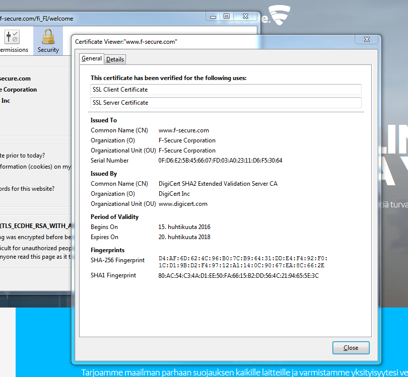
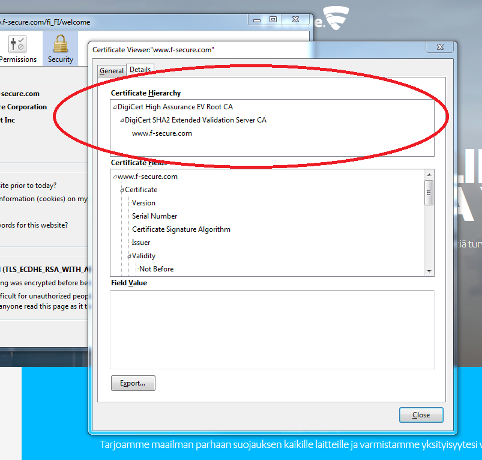
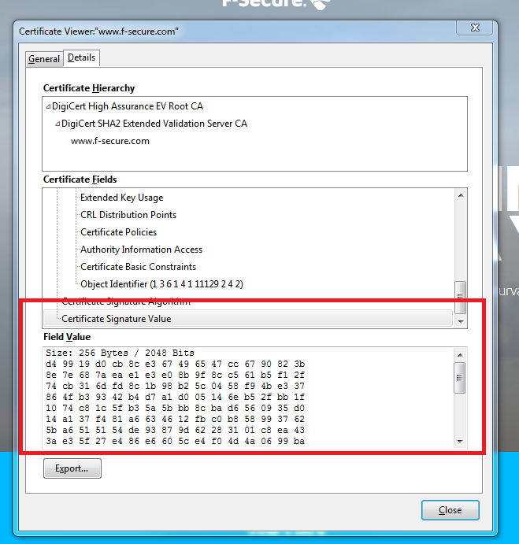

<deadline>22.02.2020</deadline>

<please-login></please-login>

The course consists of 5 parts.

### On Advanced Topics

This material contains the advanced topics part of the course series [Cyber
Security Base](https://cybersecuritybase.mooc.fi/). During this
course, you will learn about topics such as internet security issues, internet
of things security issues, issues in 4G networks as well as the issues and
remedies planned for the upcoming 5G network. This includes also relevant
cryptography topics. Architectural analysis of existing (software) systems will
be also visited.

By continuing, you agree to not to do any harm with this information or other
similar information on the internet.

### How to get started

In order to answer the questionnaires and essays, you will need a MOOC.fi
account that you can create at [https://mooc.fi](https://mooc.fi). The same
account that you did for the introduction part works here as well. Once you've
signed up, you can login to this page (click on the top right corner).

Once you have created the account, please answer a background questionnaire at
[https://elomake.helsinki.fi/lomakkeet/74256/lomake.html](https://elomake.helsinki.fi/lomakkeet/74256/lomake.html). 
Answering the questionnaire should take less than 10 minutes and will be very
valuable for the research conducted on this course.

When answering the short essay questions in this course, please answer them
carefully and with thought. Other participants in the course will review them
and may give you feedback.

### How to pass the course

To pass the course you need to get 51 points (max 60 points).  Each passed
essay or completed programming exercise is equivalent to 5 points, and each
multiple choice question is equivalent of 1 point.

To pass an essay, you need to write an essay within the given length, and
provide 3 reviews.  We also may reject your answer if it's flagged too many
times as spam or if it doesn't contain deep enough discussion. Also, we may
reject your peer reviews if you haven't put genuine effort into them.

# Cryptography

In the last part we discussed about logging. In this part we are giving a rudimentary introduction to relevant cryptography concepts.

## Introduction to HTTPS

The purpose of the HTTPS protocol is to enable secure web browsing. From the user point of view, it is important to know whether she connects to a website over an unsecure HTTP connection or over a secure HTTPS connection. Different browsers indicate this in different ways.

Next we see how an example of how a particular browser provides the indication. You should try to figure out how the indication works in all different browsers that you use.

The indicator of https protocol is a small lock next to the url:

Let&rsquo;s click the lock, then the right arrow and go for more information. We get something that looks like this:

This tab provides lots of information. We will take a closer look at many strange acronyms that appear under &rdquo;Technical details&rdquo;.

What do these letters mean and why are they needed?

## Basic concepts

First thing that may come to your mind when you hear the word &rdquo;cryptography&rdquo; is about transforming normal messages into secret messages and back.

This is not a false impression but there is quite much more in cryptography as well.

But let us start with the basic setting and define some basic terms.

We call the original message that is supposed to be kept hidden the _plaintext_. The idea of ciphering is to use some _encryption function_ and some _encryption key_ to get the _cryptotext._ That is the message in the hidden form. For the reverse direction, we need a _decrypting function_, a method that is used together with a _decryption key_ in order to retrieve the original plaintext.

Encryption is used to protect _confidentiality_ of the data.

An important building block in cryptography is a _one-way function_ (OWF). An OWF is a function that, from the one hand, can be efficiently evaluated. This means it is easy to calculate _y = f_(_x_) when _x_ is given as an input. In this context &rdquo;easy&rdquo; means something that is easily doable with the help of any kind of computer. On the other hand, it should be hard to invert the OWF. This means it is very difficult to find out _x_, if you only know _f_ and _y_.

_Cryptographic hash function_ is a special type of an OWF such that
- the output _y_ is always of fixed length
- it is hard to find collisions.

A collision is a situation where two different inputs _x_ and _x&rsquo;_ give the same output: _f_(_x_) = _f_(_x&rsquo;_).

SHA-256 and SHA-3 are two commonly used cryptographic hash functions. It you calculate the SHA-256 value of any binary string, the result is a random-looking string of 256 bits.

Because the length of the input is not restricted, it is obvious that many different inputs must exist that have the same output. But what is important is that no such collisions are known for the SHA-256 function.

The output of different variants of SHA-3 are of different length. However, there are no variants with a very short output length.

Q: Why a cryptographic hash function cannot have an output length of 3 bits?

All details of hash functions are publicly known and, in principle, anybody can calculate the hash value of any input. Sometimes it is useful that only a person who knows a secret key is able to calculate the hash value. Functions like this are called _message authentication codes_ (MAC) and the value of the function is called the MAC value.

Let us assume that you know some secret key and you have received a message and a MAC value. If you now use the received message and the secret key as inputs to the functions and find out that the output of the function is equal to the received MAC value, then you can be reasonably sure that somebody who knows the secret key must have calculated the MAC value. In addition, you are able to conclude that the message has not been changed after the calculation of the MAC value on the sending side.

Summary: Message authentication codes are used to protect _integrity_ of the data.

One of the commonly used methods for constructing a MAC function is [hmac](https://en.wikipedia.org/wiki/Hash-based_message_authentication_code). It is built on top of some hash function, e.g. SHA-256 or SHA-3.

Our HTTPS example (`TLS_ECDHE_RSA_WITH_AES_256_GCM_<B>SHA384</B>_256 bit keys,TLS 1.2`) makes use of a SHA384 hash function.

<!-- QUIZ -->
<quiz id="c50875ec-06a3-58dd-a534-f6fafce90eb0"></quiz>

## Symmetric cryptography

All classical (i.e. more than 40 years old) ciphering methods are _symmetric_. This means that anybody who knows the function and the secret key needed for encrypting messages is also able to decrypt messages. In other words, encryption and decryption are in symmetric roles. The encryption function and the decryption function have very similar structures; sometimes they could even be equal to each other. The key used for encryption is the same key that is used for decryption; or at least each key can be derived from the other by some simple transformation.

There are nowadays also encryption methods that are _not_ symmetric, i.e., being able to encrypt does not guarantee that you are able to decrypt even your own message. This kind of _asymmetry_ is useful in many situations and we will discuss those later.

Symmetric encryption methods are still useful in many situations, and they are typically much faster than asymmetric ones. Therefore, symmetric encryption is in wide use, and new symmetric methods are developed. One-time pad (OTP) and AES are examples of symmetric encrypting schemes.

One of the oldest encryption methods is substituting every instance of a letter with some other letter. A cipher like this is called a _substitution cipher_. An example is the _CAESAR_ cipher which is an encryption algorithm where you get the cryptotext by rotating every letter in the plaintext three positions forward in the alphabet. Decryption is done by rotating every letter of the cryptotext three positions backwards.

<quiz id="6ce2d9b0-e42c-56c9-a92c-0373ae53c405"></quiz>

<quiz id="220b1b7d-59b7-5e14-9647-c27ee4266589"></quiz>

One-time pad (OTP) is one of the simplest encryption methods. To encrypt a message of, say, 140 bits you need a secret key of 140 bits. You compute the XOR of each message bit with the corresponding key bit, and you get 140 cryptotext bits:

C = M xor K.

The decrypting process is exactly the same as the encryption process. If you know the secret key you can decrypt the message by XORing bit-by-bit the cryptotext message and the key:

M = C xor K.

This works because

C xor K = (M xor K) xor K = M xor (K xor K) = M xor 0 = M.

Although OTP is very simple and fast, it possesses some very good security properties. We are going to discuss those later.

The only downside of the OTP is that the key must be as long as the actual plaintext message. And you should not use the key more than once, hence the name &rdquo;one-time pad&rdquo;.

<quiz id="11d13cee-4ae1-5c0d-bdf3-414b28793227"></quiz>

Advanced Encryption Standard ([AES](https://en.wikipedia.org/wiki/Advanced_Encryption_Standard)) is a family of modern _block ciphers_. AES-256 has key size of 256 bits and it turns 128-bit plaintext blocks into 128-bit cryptotext blocks, and vice versa. This algorithm is quite fast even when implemented in software and considered secure enough for almost all uses. Many modern processors provide hardware support for AES.

<quiz id="4db82e12-bb2a-5ced-b9c4-96e93418a1a6"></quiz>

## Cryptanalysis

_Cryptanalysis_ is the study of cryptographic algorithms and methods. The basic goal is to _break_ cryptographic algorithms in one way or another. For example, the attacker may have acquired knowledge of some cryptotexts and the corresponding plaintexts. Then he tries to use this information for finding the used key. In another setting, we assume that the attacker has only some cryptotexts based on which the key should be found. It is always assumed that the attacker knows all details of the encryption and decryption processes, only the secret key is not known. If this cannot be assumed then the encryption method is considered to be very weak.

Let us take a look at the substitution cipher. Now every occurrence of the letter &rsquo;e&rsquo; in the plaintext is encrypted as the same letter in the cryptotext, lets say &rsquo;&Aring;&rsquo;. Because &rsquo;e&rsquo; is the most common letter in the English language, &rsquo;&Aring;&rsquo; should be one of the most common letters of the cryptotext. So we may assume that the common letters in the cryptotext correspond to common letters in the language of the plaintext and use this information for making educated guesses about how each letter is encrypted. This cryptanalytic approach is called _frequency analysis_.

The same approach cannot be used against OTP. If the key is chosen randomly, both 0 and 1 appear as often in the cryptotext, in average. This happens regardless of how common 1 is in the plaintext. In fact, any cryptotext could result from any plaintext with a suitable key. Assume the known cryptotext bit is C. Now the corresponding plaintext bit could be either C (which happens if the key bit is zero) or 1-C (which happens if the key bit is one). Therefore, knowing the cryptotext does not provide any new information about the plaintext to the attacker. This means the OTP is _unconditionally_ secure.

For the OTP, we applied the setting where the attacker knows only the cryptotext. If the attacker knows both the cryptotext and the corresponding plaintext, then he can easily recover the used key. However, breaking OTP in this setting is not relevant because the recovered key is not used to encrypt anything else than the plaintext that the attacker already knows.

## Modes of operation

A block cipher, like AES, is used to encrypt blocks of a certain size. What should be done if the message is longer than that size?

The simplest way to encrypt a long message is to take the first block, encrypt it using the key to produce the first cryptotext block, then take the second block, encrypt it using the same key to produce the second cryptotext block etc. This approach is one of the [block cipher modes of operation](https://en.wikipedia.org/wiki/Block_cipher_mode_of_operation), called _Electronic Codebook_ (ECB). It is the simplest way but often could be broken by frequency analysis. The attacker notices if you encrypt the same plaintext block twice because the two cryptotexts are also the same. This happens, for example, if plaintext contains some commonly used short pattern, like 'OK'.

Other modes of operation avoid this problem by using extra input in addition to plaintext and key. For instance, previously computed cryptotext blocks or _counters_ could be used for this purpose. Our HTTPS example (`TLS_ECDHE_RSA_WITH_<B>AES_256_GCM</B>_SHA384_256 bit keys,TLS 1.2`) makes use of AES algorithm in _Galois/Counter Mode_. The key length is 256 bits.

## Public-key cryptography

In symmetric encryption the same key is used both for encryption and decryption. In public key cryptography we have a separate key for encryption and another one for decryption. This makes sense if it is hard to determine the decryption key even if the encryption key is known.

If this is the case then you could tell everybody how to encrypt messages they want to send to you but still only you would know how to decrypt these messages. This explains the name: encryption key could be made public while the corresponding decryption key still remains secret.

Typically the keys are longer and the algorithms are slower in public-key cryptography than in the symmetric encryption. But with public-key cryptography you are able to do things which cannot be done with symmetric encryption.

The above mentioned possibility for even strangers to send confidential messages to you is one such thing. _Digital signature_ is another such thing: Using public-key cryptography it is possible to _sign_ messages electronically and to _authenticate_ users and their messages.

At this point we cannot avoid getting a little bit mathematical. Let us denote by _a mod b_ the _remainder_ when _a_ is divided by _b_. The _b_ here is called the _modulus_. For example, 12 _mod_ 5 = 2 and 77 _mod_ 8 = 5.

Also, we make use of _prime _numbers, shortly _primes_. An integer, larger than 1, is a prime if it is only divisible by 1 and itself. For example, 7, 101 and 7823 are primes but 6, 15 and 100 are not.

Given integers <I>a</I>, <I>b</I> and <I>c</I>, it is easy (at least in principle) to calculate <I>a</I><I>b</I> <I>mod c</I>. This <I>modular exponentiation</I> is relatively easy to do even when the integers <I>a</I>, <I>b</I> and <I>c </I>are very big<I>. </I>With big <I>a</I> and <I>b</I> the power <I>a</I><I>b </I>becomes huge. Luckily we do not have to compute this huge number at all. Instead, it is possible to compute the remainder for each intermediate value before continuing. Let us take a simple example: <I>a</I>=2, <I>b</I>=60, <I>c</I>=1003. Now <I>a</I><I>b</I> = (210)6.

We first compute 210=1024. Then we take the remainder of this intermediate result: 1024 <I>mod</I> 1003 = 21. Next we raise 21 to the power of 3. The result is 9261. Taking the remainder again with the modulus 1003 we get 234. The final step is to raise 234 to the power of 2: the result is 54756. Taking the remainder again we get the final result: <I>a</I><I>b</I> <I>mod c</I> = 594.

On the other hand, when arbitrary integers <I>a</I>, <I>c</I> and <I>d</I> are given, it is very hard to find an integer <I>b</I> such that <I>ab mod c = d.</I> This problem is called the <EM>discrete logarithm problem</EM>. We use the notation

log<I>a d <I>mod</I> c = b.</I>

Because modular exponentiation can be done relatively fast even for large numbers but the inverse problem of finding the discrete logarithm becomes very hard for large numbers, modular exponentiation with large numbers is an example of a one-way function.

Let us take a closer look at the discrete logarithm with small numbers. We choose <I>c</I> = 101 and below see a graph depicting 2<I>x</I> mod 101.

Note that the graph is not smooth and it is not growing like the &rsquo;normal&rsquo; exponential function defined for real numbers. Instead, the graph seems to make random-looking moves.

<quiz id="265fda67-3a96-52c5-954b-d6d3b26cc9ff"></quiz>

A _key agreement protocol_ is a method for two parties, say Alice and Bob, to agree on a shared secret key over an insecure channel, but still in such way that nobody else who is eavesdropping on the channel is able to learn the shared secret. An example of such method is _Diffie-Hellman key agreement protocol_.

The Diffie-Hellman key exchange begins by Alice and Bob agreeing on a modulus <I>p</I> and a number <I>g</I>. Then Alice picks a random number <I>a</I> and sends Bob the number <I>ga mod p = u.</I> Similarly, Bob picks a random number <I>b</I> and sends Alice the number <I>gb mod p = v</I>. Now Alice can calculate <I>va mod p</I> and Bob can calculate <I>ub</I> mod p. These two values are both equal to <I>gab mod p</I> and that value can now be used as the new shared secret key.

Our HTTPS example (`TLS_<B>ECDHE</B>_RSA_WITH_AES_256_GCM_SHA384_256 bit keys,TLS 1.2`)  makes use of a certain variant of the Diffie-Hellman key exchange.

## RSA

Next we take a look at how public-key cryptosystems look like. The most used system is called [RSA](https://en.wikipedia.org/wiki/RSA_%28cryptosystem%29). It is based on the following mathematical fact:

<B>if</B> <I>p</I> and <I>q</I> are primes, <I>n = p&middot;q</I> and <I>e&middot;d mod</I> (<I>p</I>-1)(<I>q</I>-1) = 1  <B>then</B> <I>xe&middot;d mod n = x</I> for all values of <I>x</I>.

To set up RSA keys, Alice first needs to find two large primes _p_ and _q_. Both primes should be at least 1000 bits long. She then needs to pick an integer _e_ such that it is possible to find another integer _d_ for which _e&middot;d mod_ (_p_-1)(_q_-1) = 1 holds. The public key of Alice is now the pair (_e,n_), where _n = p&middot;q_. The private key that Alice needs to decrypt messages is the pair (_d,n_). Alice should not reveal the primes _p_ and _q_ to anybody.

Let us assume that Alice has given her public key to Bob. Bob can now encrypt any &quot;message&quot; <I>x</I> that is (encoded as) an integer between 0 and <I>n</I> by calculating <I>xe mod n = y.</I> Bob would send the result to Alice. Alice can decrypt the cryptotext <I>y</I> because she knows the secret decrypting exponent <I>d</I>. She calculates <I>yd mod n = x.</I>

A traditional signature is some ink on a paper. It is based on the assumption that only one person can write a signature in a certain way. A _digital signature_ is always different for every message (otherwise you could just copy-paste it to any document) and only a person who has the _signing key_ can calculate it correctly. The signature can be verified by anybody who has the _verification key_.

RSA can be used also for digital signing and verification. Alice reveals the verification key (<I>e,n</I>) and uses herself the signing key (<I>d,n</I>). If Alice wants to sign message <I>x</I>, she calculates the signature as <I>xd mod n = s.</I> When Bob receives the message <I>x</I> and the signature <I>s</I>, he can check that <I>se mod n = x.</I> If this is true then the signature must be from Alice because nobody else knows the parameter <I>d</I> thats is necessarily needed to calculate Alice&rsquo;s signatures.

Usually the signature is not computed for the entire message but, instead, a hash of the message is computed first, and then the hash value is signed. This guarantees that the value to be signed does not become too big. On the verification side, similarly, the received message is first given as an input to the hash function, and parallel to that, the verification key (_e,n_) is applied to the signature. If outputs from each operation are equal then the signature is accepted. The hash value of the message is called its _fingerprint_, and it can be used instead of the entire message if no collisions have been found for the hash function.

Our HTTPS example (`TLS_ECDHE_<B>RSA</B>_WITH_AES_256_GCM_SHA384_256 bit keys,TLS 1.2`)  makes use of RSA for digital signatures.

## Certificates

One important part of the digital signature process was explained above as follows: _Let us assume that Alice has given her public key to Bob_. But this imposes quite a big restriction: Bob can only verify signatures from such parties with whom he has already been in contact beforehand. It would be better if Bob could get Alice&rsquo;s public key just when a need to verify her signature arises, without any preparations in advance.

A straight-forward solution would be that Alice provides her public key together with the message that she has digitally signed. But now we encounter a &rdquo;chicken-and-egg&rdquo; problem because the whole point of the digital signature is to verify that the message is really coming from Alice, and not from somebody who just pretends to be Alice. If the public key of Alice is delivered together with the message, and this public key should be used to verify the origin of the message, then an imposter could just include a fake public key to the delivery, i.e., a key for which the corresponding private key is in the possession of the imposter, not Alice.

One way out of the &rdquo;chicken-and egg&rdquo; situation is found if Alice&rsquo;s public key is signed by somebody whose signatures Bob is able to verify, e.g., by some authority. Such digitally signed information is called a _certificate_. Note that the authority is just endorsing Alice&rsquo;s public key, the authority does not have to  take any stand on messages that Alice is sending.

A typical example where certificates are needed is when a user wants to get some assurance of the validity of the web page he visits. HTTPS protocol enables this and the _authentication_ of the web server is carried out by digital signatures, based on a certificate.

All browsers provide information about the certificate. In our example, the information can be found as shown below.

What has been signed is the fingerprint of the information in the certificate. The authority who has signed the certificate is &rdquo;DigiCert SHA2 Extended Validation Server CA&rdquo;.

<quiz id="e75fddf6-e2a4-5794-b8c8-71a1a9303e58"></quiz>

## Public-key infrastructure

Our solution to the &rdquo;chicken-and-egg&rdquo; problem did not remove all restrictions. We still assumed that

- Authority _A_ has verified somehow Alice&rsquo;s identity and, consequently, has signed Alice&rsquo;s public key;
- Bob has somehow acquired the public key of the _same_ authority _A_.

Such an authority _A_ is called a _Certificate Authority_ (CA). But it should be possible for Alice and Bob to be in contact with _different_ authorities. Otherwise, the CA easily becomes a bottleneck in the system.

A typical solution for this problem is to arrange a _hierarchy_ of authorities. For example, Bob could have a public key of a _root _CA, e.g., in-built into his browser. This root CA would then provide certificates for other CAs that are one level lower in the hierarchy. These CAs could provide certificates for public keys of _regional_ CAs, and Alice could be in contact with one such regional CA.

Bob would need to verify all certificates in a _certificate chain_. Once all certificates are verified, Bob is finally able to verify Alice&rsquo;s signature.

All CAs, together with some other authorities (that are needed, e.g., for managing _revoked_ certificates), form a _public-key infrastructure_ (PKI).

In our HTTPS example, the certificate chain has a length of two. &rdquo;DigiCert SHA2 Extended Validation Server CA&rdquo; has provided a certificate for the F-Secure website, and &rdquo;DigiCert High Assurance EV Root CA&rdquo; has provided a certificate for &rdquo;DigiCert SHA2 Extended Validation Server CA&rdquo;. The root CA public key needs to be embedded in the browser for successful authentication of the website.

The actual signature value of the certificate is provided as shown below.

<quiz id="4b281ce2-7b76-5338-9837-142c41a210e5"></quiz>

<exercises-in-this-section></exercises-in-this-section>
