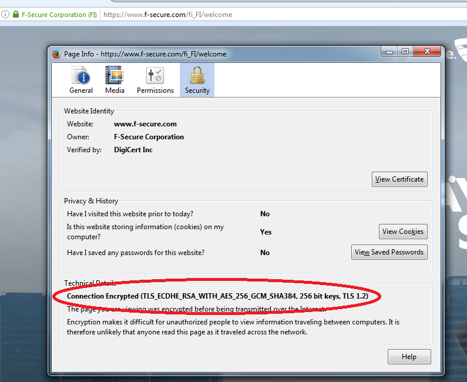

In the last part we discussed about logging. In this part we are giving a rudimentary introduction to relevant cryptography concepts.

## Introduction to HTTPS

The purpose of the HTTPS protocol is to enable secure web browsing. From the user point of view, it is important to know whether she connects to a website over an unsecure HTTP connection or over a secure HTTPS connection. Different browsers indicate this in different ways.

Next we see how an example of how a particular browser provides the indication. You should try to figure out how the indication works in all different browsers that you use.

The indicator of https protocol is a small lock next to the url:


Let&rsquo;s click the lock, then the right arrow and go for more information. We get something that looks like this:


This tab provides lots of information. We will take a closer look at many strange acronyms that appear under &rdquo;Technical details&rdquo;.

What do these letters mean and why are they needed?



## Basic concepts

First thing that may come to your mind when you hear the word &rdquo;cryptography&rdquo; is about transforming normal messages into secret messages and back.

This is not a false impression but there is quite much more in cryptography as well.

But let us start with the basic setting and define some basic terms.

We call the original message that is supposed to be kept hidden the _plaintext_. The idea of ciphering is to use some _encryption function_ and some _encryption key_ to get the _cryptotext._ That is the message in the hidden form. For the reverse direction, we need a _decrypting function_, a method that is used together with a _decryption key_ in order to retrieve the original plaintext.

Encryption is used to protect _confidentiality_ of the data.

An important building block in cryptography is a _one-way function_ (OWF). An OWF is a function that, from the one hand, can be efficiently evaluated. This means it is easy to calculate _y = f_(_x_) when _x_ is given as an input. In this context &rdquo;easy&rdquo; means something that is easily doable with the help of any kind of computer. On the other hand, it should be hard to invert the OWF. This means it is very difficult to find out _x_, if you only know _f_ and _y_.

_Cryptographic hash function_ is a special type of an OWF such that
- the output _y_ is always of fixed length
- it is hard to find collisions.

A collision is a situation where two different inputs _x_ and _x&rsquo;_ give the same output: _f_(_x_) = _f_(_x&rsquo;_).

SHA-256 and SHA-3 are two commonly used cryptographic hash functions. It you calculate the SHA-256 value of any binary string, the result is a random-looking string of 256 bits.

Because the length of the input is not restricted, it is obvious that many different inputs must exist that have the same output. But what is important is that no such collisions are known for the SHA-256 function.

The output of different variants of SHA-3 are of different length. However, there are no variants with a very short output length.

Q: Why a cryptographic hash function cannot have an output length of 3 bits?

All details of hash functions are publicly known and, in principle, anybody can calculate the hash value of any input. Sometimes it is useful that only a person who knows a secret key is able to calculate the hash value. Functions like this are called _message authentication codes_ (MAC) and the value of the function is called the MAC value.

Let us assume that you know some secret key and you have received a message and a MAC value. If you now use the received message and the secret key as inputs to the functions and find out that the output of the function is equal to the received MAC value, then you can be reasonably sure that somebody who knows the secret key must have calculated the MAC value. In addition, you are able to conclude that the message has not been changed after the calculation of the MAC value on the sending side.

Summary: Message authentication codes are used to protect _integrity_ of the data.

One of the commonly used methods for constructing a MAC function is [hmac](https://en.wikipedia.org/wiki/Hash-based_message_authentication_code). It is built on top of some hash function, e.g. SHA-256 or SHA-3.

Our HTTPS example (`TLS_ECDHE_RSA_WITH_AES_256_GCM_SHA384_256 bit keys,TLS 1.2`) makes use of a SHA384 hash function.

<!-- QUIZ -->
<quiz id="f3fe5995-e526-51cf-a051-a1896cdaa7c0"></quiz>

<programming-exercise name="Break the hash" tmcname="part3-01.password" course="Advanced Topics">

In this exercise you are given a hash and a list of candidate passwords, and
your task is to write a password guesser that finds the password in the candidates that was used to generate the hash.

The hash follows a common format used for storing hashed password
```
procotol$salt$hash
```
Here, the protocol will always be set to 42, so you can ignore it.
For hashing we will use SHA-384. In this exercise, the hash is constructed by hashing a message containing the salt followed by the actual password.
In practice, the combination of salt and the password is significantly more convoluted.

The salt and the password hash are both base64 encoded in the hash string, and need to be decoded.

_Hints:_
1. You will find hashlib and base64 libraries useful.
2. The hash and the candidates are all text strings but the above libraries operate with byte arrays. Use `encode('utf-8')` to get a byte array from a text string.

</programming-exercise>


## Symmetric cryptography

All classical (i.e. more than 40 years old) ciphering methods are _symmetric_. This means that anybody who knows the function and the secret key needed for encrypting messages is also able to decrypt messages. In other words, encryption and decryption are in symmetric roles. The encryption function and the decryption function have very similar structures; sometimes they could even be equal to each other. The key used for encryption is the same key that is used for decryption; or at least each key can be derived from the other by some simple transformation.

There are nowadays also encryption methods that are _not_ symmetric, i.e., being able to encrypt does not guarantee that you are able to decrypt even your own message. This kind of _asymmetry_ is useful in many situations and we will discuss those later.

Symmetric encryption methods are still useful in many situations, and they are typically much faster than asymmetric ones. Therefore, symmetric encryption is in wide use, and new symmetric methods are developed. One-time pad (OTP) and AES are examples of symmetric encrypting schemes.

One of the oldest encryption methods is substituting every instance of a letter with some other letter. A cipher like this is called a _substitution cipher_. An example is the _CAESAR_ cipher which is an encryption algorithm where you get the cryptotext by rotating every letter in the plaintext three positions forward in the alphabet. Decryption is done by rotating every letter of the cryptotext three positions backwards.

<quiz id="3a5453bf-b04d-589c-a4f9-576a13ad11e0"></quiz>

<quiz id="08501100-222f-590b-a39a-57eeee1dc08a"></quiz>

<programming-exercise name="Substitution cipher" tmcname="part3-02.substitution" course="Advanced Topics">

Implement a substitution cipher: complete `encrypt` and `decrypt` functions in `src/substitution.py`.

Both functions are byte arrays and should output an byte array as an output.
The key is an array such that `key[c]` is equal to the _encrypted_ value of `c`.

</programming-exercise>


One-time pad (OTP) is one of the simplest encryption methods. To encrypt a message of, say, 140 bits you need a secret key of 140 bits. You compute the XOR of each message bit with the corresponding key bit, and you get 140 cryptotext bits,

$$
C = M \oplus K.
$$

The decrypting process is exactly the same as the encryption process. If you know the secret key you can decrypt the message by XORing bit-by-bit the cryptotext message and the key,

$$
M = C \oplus K.
$$

This works because

$$
C \oplus K = (M \oplus K) \oplus K = M \oplus (K \oplus K) = M \oplus 0 = M.
$$


Although OTP is very simple and fast, it possesses some very good security properties. We are going to discuss those later.

The only downside of the OTP is that the key must be as long as the actual plaintext message. And you should not use the key more than once, hence the name &rdquo;one-time pad&rdquo;.


<quiz id="717176c8-6157-5cef-af97-a9d9a28b49d7"></quiz>

<programming-exercise name="Repeating pads" tmcname="part3-03.xorpad" course="Advanced Topics">

Implement a xorpad cipher: complete `encrypt` and `decrypt` functions in `src/xorpad.py`.
Both functions are byte arrays and should output an byte array as an output.

The pad can be significantly shorter than the message. In such a case you should repeat the pad as long as needed.

Note that repeating short pads is highly problematic, for example, one can
deduce the pad if a short part of message is known in advance (can you figure out how?). Thus, this should not be used in practice.

</programming-exercise>

Advanced Encryption Standard ([AES](https://en.wikipedia.org/wiki/Advanced_Encryption_Standard)) is a family of modern _block ciphers_. AES-256 has key size of 256 bits and it turns 128-bit plaintext blocks into 128-bit cryptotext blocks, and vice versa. This algorithm is quite fast even when implemented in software and considered secure enough for almost all uses. Many modern processors provide hardware support for AES.

<quiz id="b6efdf2e-be26-5aa2-917f-7b2bb6b6a511"></quiz>
